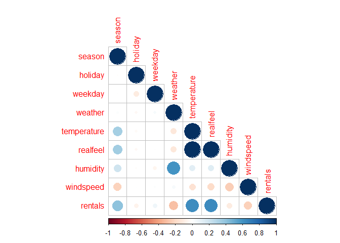

ch4LinearRegression
================
Jason Elder
2023-09-12

# Regression

questions we can answer with regression include - is there a
relationship between any of the independatn variables and the dependatn
variable

- how strong is that relationship

- is it a positive or negative relationship

- is the relationship linear

- if it is, how accurately can we predict our dependant variable (Y)
  with our current data

- how accurately can we predict future data

note: most common (correlation coefficent) for linear regression is
pearson $rho$

- \<0.3 = weak

- \< 0.5 & \> .03 = moderate

- \> 0.5 = strong

# packages

``` r
library(tidyverse)
library(stats)
library(corrplot)
library(psych)
library(emo)
```

    ## 😿

``` r
bikes <- 'Data/bikes.csv'

bikes <- read_csv(bikes, show_col_types = F)
# look at data

str(bikes)
```

    ## spc_tbl_ [731 × 10] (S3: spec_tbl_df/tbl_df/tbl/data.frame)
    ##  $ date       : Date[1:731], format: "2011-01-01" "2011-01-02" ...
    ##  $ season     : num [1:731] 1 1 1 1 1 1 1 1 1 1 ...
    ##  $ holiday    : num [1:731] 0 0 0 0 0 0 0 0 0 0 ...
    ##  $ weekday    : num [1:731] 6 0 1 2 3 4 5 6 0 1 ...
    ##  $ weather    : num [1:731] 2 2 1 1 1 1 2 2 1 1 ...
    ##  $ temperature: num [1:731] 46.7 48.4 34.2 34.5 36.8 ...
    ##  $ realfeel   : num [1:731] 46.4 45.2 25.7 28.4 30.4 ...
    ##  $ humidity   : num [1:731] 0.806 0.696 0.437 0.59 0.437 ...
    ##  $ windspeed  : num [1:731] 6.68 10.35 10.34 6.67 7.78 ...
    ##  $ rentals    : num [1:731] 985 801 1349 1562 1600 ...
    ##  - attr(*, "spec")=
    ##   .. cols(
    ##   ..   date = col_date(format = ""),
    ##   ..   season = col_double(),
    ##   ..   holiday = col_double(),
    ##   ..   weekday = col_double(),
    ##   ..   weather = col_double(),
    ##   ..   temperature = col_double(),
    ##   ..   realfeel = col_double(),
    ##   ..   humidity = col_double(),
    ##   ..   windspeed = col_double(),
    ##   ..   rentals = col_double()
    ##   .. )
    ##  - attr(*, "problems")=<externalptr>

``` r
# gonna have to make some of these factors

any(is.na(bikes))
```

    ## [1] FALSE

``` r
# no NAs :)
```

# correlations

``` r
emo::ji('face')
```

    ## 🤦

``` r
bikesNum <- bikes %>% 
  select(-date)
rawcor <- cor(x = bikesNum) # correlation nums

corrplot(rawcor,  type = 'lower') # good looking
```

<!-- -->

# regression

lm is wierd in that data is not the first default argument

``` r
bikes_lm1 <- lm(data = bikes, rentals ~ temperature)
summary(bikes_lm1)
```

    ## 
    ## Call:
    ## lm(formula = rentals ~ temperature, data = bikes)
    ## 
    ## Residuals:
    ##     Min      1Q  Median      3Q     Max 
    ## -4615.3 -1134.9  -104.4  1044.3  3737.8 
    ## 
    ## Coefficients:
    ##             Estimate Std. Error t value Pr(>|t|)    
    ## (Intercept) -166.877    221.816  -0.752    0.452    
    ## temperature   78.495      3.607  21.759   <2e-16 ***
    ## ---
    ## Signif. codes:  0 '***' 0.001 '**' 0.01 '*' 0.05 '.' 0.1 ' ' 1
    ## 
    ## Residual standard error: 1509 on 729 degrees of freedom
    ## Multiple R-squared:  0.3937, Adjusted R-squared:  0.3929 
    ## F-statistic: 473.5 on 1 and 729 DF,  p-value: < 2.2e-16

model interpretation

this is what the model is  

###### Call: lm(formula = rentals \~temperature, data = bikes)

this is the descriptive stats for the residuals of the model min means
our model over predicted the number of bikes by 4615 at least once. the
max means that our model under predicted the number of bikes by 3737 at
least once. when median is (-) then our model over predicts rentals on
more than half the observations.

key: observed minus predicted

###### Residuals:

###### Min 1Q Median 3Q Max

###### -4615.3 -1134.9 -104.4 1044.3 3737.8

Estimate is the betas ()for each predictor. Std = spread from the
estimate, lower is better. t = effective size of predictor p =
significance of predictor

###### Coefficients:

###### Estimate Std. Error t value Pr(\>\|t\|)

###### (Intercept) -166.877 221.816 -0.752 0.452

###### temperature 78.495 3.607 21.759 \<2e-16 \*\*\*

###### —

###### Signif. codes: 0 ‘***’ 0.001 ’**’ 0.01 ’*’ 0.05 ‘.’ 0.1 ’ ’ 1

RSE = measures $lack$ $of$ $fit$ this means on average the model
predicted 1509 bikes away from the true values. ( in units of Y)  

multiple R^2 (a.k.a coeficcient of determination) = is a proportion, how
much of the variability of the data is explained by the model. .39 = 39%
of the variability in the data set is explained by the model.  

adjusted R^2 = is adjusted for how many predictors are used. can be used
to compare across models with differing number of predictors.  

F-stat = tells if there is is a relationship between the predictors and
the response variables. this one is large so we can say there is a
strong relationship between the predictors and response vars. GIVEN that
the p value is small.  

p value = the likely hood that a relationship is due to chance. smaller
is better.  

###### Residual standard error: 1509 on 729 degrees of freedom

###### MultipleR-squared: 0.3937, AdjustedR-squared: 0.3929

###### F-statistic: 473.5 on 1 and 729 DF, p-value: \< 2.2e-16

``` r
bikes_lm2 <- lm(rentals~ humidity + windspeed + temperature, data = bikes)
summary(bikes_lm2)
```

    ## 
    ## Call:
    ## lm(formula = rentals ~ humidity + windspeed + temperature, data = bikes)
    ## 
    ## Residuals:
    ##     Min      1Q  Median      3Q     Max 
    ## -4780.5 -1082.6   -62.2  1056.5  3653.5 
    ## 
    ## Coefficients:
    ##              Estimate Std. Error t value Pr(>|t|)    
    ## (Intercept)  2706.002    367.483   7.364 4.86e-13 ***
    ## humidity    -3100.123    383.992  -8.073 2.83e-15 ***
    ## windspeed    -115.463     17.028  -6.781 2.48e-11 ***
    ## temperature    78.316      3.464  22.606  < 2e-16 ***
    ## ---
    ## Signif. codes:  0 '***' 0.001 '**' 0.01 '*' 0.05 '.' 0.1 ' ' 1
    ## 
    ## Residual standard error: 1425 on 727 degrees of freedom
    ## Multiple R-squared:  0.4609, Adjusted R-squared:  0.4587 
    ## F-statistic: 207.2 on 3 and 727 DF,  p-value: < 2.2e-16

# Diagnostics

these are assumption checks that have to do with the residuals

- residuals have a mean of zero
- residuals are normally distributed
- residuals have equal variance across the values of the independent
  variable (homoscedasticity)
- residuals are not correlated

# packages

``` r
library(olsrr)
library(lmtest) # has bptest
library(car) # has durbin watson test
```

``` r
# Zero mean of residuals?
mean(bikes_lm2$residuals)
```

    ## [1] -2.962843e-13

``` r
# normally distributed?
ols_plot_resid_hist(bikes_lm2)
```

<!-- -->

``` r
ols_plot_resid_fit(bikes_lm2)
```

<!-- -->

``` r
# homoscedasticity 
# there are two ways to test for this. can use the Breusch-Pagan stats test. or can plot it. we gonna plot it. is the otherside of heteroscedasticity. we dont want heteroscedasticity (this is a bias in the distribution of resuduals). but rather we want there to be no pattern in how to residuals are distributed around the model fit (the line). 

ols_plot_resid_fit(bikes_lm2)
```

<!-- -->

``` r
# looks like our data is a bit heterscedastic (this is the bad one). we can fix this using weighted regression. or we can do a log transformation on the dependant variable. 

ols_plot_resid_fit(lm(log2(rentals)~ temperature + humidity + windspeed, data = bikes))
```

<!-- -->

``` r
ols_plot_resid_fit(lm(log10(rentals)~ temperature + humidity + windspeed, data = bikes))
```

<!-- -->

``` r
# this doesnt seem to have helped, but we could run the stats test to actually see if there is a difference. 


bptest(lm(log2(rentals)~ temperature + humidity + windspeed, data = bikes))
```

    ## 
    ##  studentized Breusch-Pagan test
    ## 
    ## data:  lm(log2(rentals) ~ temperature + humidity + windspeed, data = bikes)
    ## BP = 15.273, df = 3, p-value = 0.001597

``` r
# it looks like we reduced heterscedasticity by half. this is pretty good I think. the problem is that now our output is hard to interpret bc its in log2 instead fo the oreginal values. 

# Residual Autocorrelation

# the test is call Durbin-Watson test. DW goes from 0 to 4.  with 0-2 being positive autocorrelation and 2-4 being negative autocorrelation. 2 = no autocorrelation, which is what we want. 


durbinWatsonTest(bikes_lm2)
```

    ##  lag Autocorrelation D-W Statistic p-value
    ##    1       0.7963326     0.4042771       0
    ##  Alternative hypothesis: rho != 0

``` r
#DW stat is .404 

# this shows us that our residuals are positively auto correlated. this can be fixed by adding new predictors to the model or transform some of the predictors. 

durbinWatsonTest(lm(log2(rentals) ~ humidity + windspeed + temperature, data = bikes))
```

    ##  lag Autocorrelation D-W Statistic p-value
    ##    1        0.622834     0.7474104       0
    ##  Alternative hypothesis: rho != 0

``` r
# DW stat = .747

# the log transformation has made the residuals less positively correlated, which is good. 
```

# Influencial Point Analysis

this is the advanced version of looking for outliers. in simple linear
regression, we could just make a box plot to find outliers but with
multiple predictors a combination of normal seeming data points could
aggregate into an observation that is extreme when compared to the rest
of the data set.

to test for this use cooks distance.

``` r
ols_plot_cooksd_chart(bikes_lm2)
```

<!-- -->

``` r
# to extract these outliers, bc there are a number of them ( use ols_plot_cooksd_bar to highlight outliers)

cooks_outliers <- ols_plot_cooksd_chart(bikes_lm2)
```

<!-- -->

``` r
# these are all the most influencial points. 
arrange(subset(x = cooks_outliers$data, subset = color == 'outlier'), decreasing = desc(cd))
```

    ##     obs          cd   color fct_color txt
    ## 69   69 0.083466470 outlier   outlier  69
    ## 239 239 0.021074076 outlier   outlier 239
    ## 204 204 0.020516659 outlier   outlier 204
    ## 50   50 0.017264207 outlier   outlier  50
    ## 203 203 0.013923865 outlier   outlier 203
    ## 668 668 0.012660294 outlier   outlier 668
    ## 205 205 0.010164468 outlier   outlier 205
    ## 210 210 0.009595062 outlier   outlier 210
    ## 554 554 0.007894590 outlier   outlier 554
    ## 212 212 0.007714449 outlier   outlier 212
    ## 251 251 0.007507810 outlier   outlier 251
    ## 250 250 0.007365982 outlier   outlier 250
    ## 266 266 0.007179789 outlier   outlier 266
    ## 211 211 0.007177980 outlier   outlier 211
    ## 160 160 0.007120294 outlier   outlier 160
    ## 631 631 0.007088713 outlier   outlier 631
    ## 208 208 0.006705139 outlier   outlier 208
    ## 530 530 0.006504121 outlier   outlier 530
    ## 433 433 0.005979306 outlier   outlier 433
    ## 543 543 0.005768543 outlier   outlier 543
    ## 45   45 0.005713411 outlier   outlier  45
    ## 708 708 0.005688624 outlier   outlier 708
    ## 106 106 0.005603058 outlier   outlier 106
    ## 341 341 0.005517340 outlier   outlier 341
    ## 463 463 0.005486960 outlier   outlier 463

``` r
# compare summaries


bikes[69,c('rentals', 'humidity', 'windspeed', 'temperature')]
```

    ## # A tibble: 1 × 4
    ##   rentals humidity windspeed temperature
    ##     <dbl>    <dbl>     <dbl>       <dbl>
    ## 1     623        0      10.9        50.5

``` r
outlier_index <- subset(x = cooks_outliers$data, subset = color == 'outlier')

summary(bikes[outlier_index$obs,c('rentals', 'humidity', 'windspeed', 'temperature')])
```

    ##     rentals        humidity        windspeed       temperature   
    ##  Min.   :  22   Min.   :0.0000   Min.   : 3.263   Min.   :49.89  
    ##  1st Qu.:1842   1st Qu.:0.4658   1st Qu.: 6.809   1st Qu.:54.61  
    ##  Median :3606   Median :0.5675   Median : 8.024   Median :71.23  
    ##  Mean   :3617   Mean   :0.5960   Mean   :10.202   Mean   :70.76  
    ##  3rd Qu.:4840   3rd Qu.:0.8800   3rd Qu.:14.291   3rd Qu.:85.77  
    ##  Max.   :8395   Max.   :0.9725   Max.   :21.127   Max.   :90.50

``` r
summary(bikes[-outlier_index$obs ,c('rentals', 'humidity', 'windspeed', 'temperature')])
```

    ##     rentals        humidity        windspeed        temperature   
    ##  Min.   : 431   Min.   :0.2758   Min.   : 0.9322   Min.   :22.60  
    ##  1st Qu.:3206   1st Qu.:0.5235   1st Qu.: 5.5992   1st Qu.:45.62  
    ##  Median :4570   Median :0.6308   Median : 7.5082   Median :59.30  
    ##  Mean   :4536   Mean   :0.6290   Mean   : 7.8498   Mean   :59.11  
    ##  3rd Qu.:5990   3rd Qu.:0.7296   3rd Qu.: 9.6318   3rd Qu.:72.87  
    ##  Max.   :8714   Max.   :0.9625   Max.   :17.5801   Max.   :88.17

``` r
# the averages are totally different so we get rid of those observations

bikes2 <- bikes[-outlier_index$obs,]
```

# Multicollinearity

when variables are highly correlated. can inflate sd, which is bad. hard
to tell which predictors are doing the work. test for variance inflation
factor $VIF$.  
if $VIF$ is greater than 5  
or tolerance is less than .2,  
you need to make a correction.

``` r
ols_vif_tol(bikes_lm2)
```

    ##     Variables Tolerance      VIF
    ## 1    humidity 0.9303623 1.074850
    ## 2   windspeed 0.9220157 1.084580
    ## 3 temperature 0.9668533 1.034283

``` r
# it looks fine
```

how to fix it if there is an issue… 1. drop theproblematic variables
form the analysis 2. combine the collinear predictors into one variable(
idk how tho)

# improving the model

### non - linear relationships

we are assuming the relationship between all our predictors and our
response is linear. to accomodate for a non- linear relationship we can
transform our predictors. this is called a polynomial regression. since
the relationships look quadratic, we can ^2 each variable. and add it to
the model

``` r
bikes2 <- bikes2 %>% 
  mutate(humidity2 = humidity^2,
         windspeed2 = windspeed^2,
         temperature2 = temperature^2)

# did it work

bikes2 %>% 
  select(humidity, humidity2) %>% 
  head()
```

    ## # A tibble: 6 × 2
    ##   humidity humidity2
    ##      <dbl>     <dbl>
    ## 1    0.806     0.649
    ## 2    0.696     0.485
    ## 3    0.437     0.191
    ## 4    0.590     0.349
    ## 5    0.437     0.191
    ## 6    0.518     0.269

``` r
bikes_lm3 <- lm(rentals ~ humidity + 
                  windspeed + 
                  temperature+ 
                  humidity2 + 
                  windspeed2 + 
                  temperature2, 
                data = bikes2)

summary(bikes_lm3)
```

    ## 
    ## Call:
    ## lm(formula = rentals ~ humidity + windspeed + temperature + humidity2 + 
    ##     windspeed2 + temperature2, data = bikes2)
    ## 
    ## Residuals:
    ##      Min       1Q   Median       3Q      Max 
    ## -3153.77  -950.91   -97.23  1034.22  3000.12 
    ## 
    ## Coefficients:
    ##                Estimate Std. Error t value Pr(>|t|)    
    ## (Intercept)  -8335.7021  1128.0572  -7.389 4.22e-13 ***
    ## humidity      6203.5583  2727.8537   2.274 0.023259 *  
    ## windspeed     -147.3909    63.5284  -2.320 0.020624 *  
    ## temperature    397.0970    25.7213  15.438  < 2e-16 ***
    ## humidity2    -8324.7772  2128.2637  -3.912 0.000101 ***
    ## windspeed2       1.5802     3.5370   0.447 0.655191    
    ## temperature2    -2.6839     0.2175 -12.339  < 2e-16 ***
    ## ---
    ## Signif. codes:  0 '***' 0.001 '**' 0.01 '*' 0.05 '.' 0.1 ' ' 1
    ## 
    ## Residual standard error: 1213 on 699 degrees of freedom
    ## Multiple R-squared:  0.6022, Adjusted R-squared:  0.5988 
    ## F-statistic: 176.4 on 6 and 699 DF,  p-value: < 2.2e-16

``` r
# we are up to 60% YAYAYA, bikes wind2 doesnt do anything sooo....

bikes_lm3 <- lm(rentals ~ humidity + 
                  windspeed + 
                  temperature+ 
                  humidity2 + 
                  # windspeed2 + 
                  temperature2, 
                data = bikes2)
summary(bikes_lm3)
```

    ## 
    ## Call:
    ## lm(formula = rentals ~ humidity + windspeed + temperature + humidity2 + 
    ##     temperature2, data = bikes2)
    ## 
    ## Residuals:
    ##     Min      1Q  Median      3Q     Max 
    ## -3167.5  -945.0  -106.7  1034.4  2984.6 
    ## 
    ## Coefficients:
    ##                Estimate Std. Error t value Pr(>|t|)    
    ## (Intercept)  -8441.8304  1102.1300  -7.660 6.22e-14 ***
    ## humidity      6172.7633  2725.4232   2.265 0.023825 *  
    ## windspeed     -119.8659    15.4807  -7.743 3.41e-14 ***
    ## temperature    397.6880    25.6726  15.491  < 2e-16 ***
    ## humidity2    -8298.1097  2126.2098  -3.903 0.000104 ***
    ## temperature2    -2.6903     0.2169 -12.402  < 2e-16 ***
    ## ---
    ## Signif. codes:  0 '***' 0.001 '**' 0.01 '*' 0.05 '.' 0.1 ' ' 1
    ## 
    ## Residual standard error: 1213 on 700 degrees of freedom
    ## Multiple R-squared:  0.6021, Adjusted R-squared:  0.5993 
    ## F-statistic: 211.8 on 5 and 700 DF,  p-value: < 2.2e-16

# categorical Predictors

``` r
#fisrt make sure they are factors 
str(bikes2)
```

    ## tibble [706 × 13] (S3: tbl_df/tbl/data.frame)
    ##  $ date        : Date[1:706], format: "2011-01-01" "2011-01-02" ...
    ##  $ season      : num [1:706] 1 1 1 1 1 1 1 1 1 1 ...
    ##  $ holiday     : num [1:706] 0 0 0 0 0 0 0 0 0 0 ...
    ##  $ weekday     : num [1:706] 6 0 1 2 3 4 5 6 0 1 ...
    ##  $ weather     : num [1:706] 2 2 1 1 1 1 2 2 1 1 ...
    ##  $ temperature : num [1:706] 46.7 48.4 34.2 34.5 36.8 ...
    ##  $ realfeel    : num [1:706] 46.4 45.2 25.7 28.4 30.4 ...
    ##  $ humidity    : num [1:706] 0.806 0.696 0.437 0.59 0.437 ...
    ##  $ windspeed   : num [1:706] 6.68 10.35 10.34 6.67 7.78 ...
    ##  $ rentals     : num [1:706] 985 801 1349 1562 1600 ...
    ##  $ humidity2   : num [1:706] 0.649 0.485 0.191 0.349 0.191 ...
    ##  $ windspeed2  : num [1:706] 44.6 107.1 106.9 44.5 60.5 ...
    ##  $ temperature2: num [1:706] 2182 2338 1170 1192 1354 ...

``` r
# if they arent, make them be
names <- names(bikes2[, c(2:5)])

bikes2[,names]<- (lapply(X = bikes2[,names], factor))

#check it 
str(bikes2)
```

    ## tibble [706 × 13] (S3: tbl_df/tbl/data.frame)
    ##  $ date        : Date[1:706], format: "2011-01-01" "2011-01-02" ...
    ##  $ season      : Factor w/ 4 levels "1","2","3","4": 1 1 1 1 1 1 1 1 1 1 ...
    ##  $ holiday     : Factor w/ 2 levels "0","1": 1 1 1 1 1 1 1 1 1 1 ...
    ##  $ weekday     : Factor w/ 7 levels "0","1","2","3",..: 7 1 2 3 4 5 6 7 1 2 ...
    ##  $ weather     : Factor w/ 3 levels "1","2","3": 2 2 1 1 1 1 2 2 1 1 ...
    ##  $ temperature : num [1:706] 46.7 48.4 34.2 34.5 36.8 ...
    ##  $ realfeel    : num [1:706] 46.4 45.2 25.7 28.4 30.4 ...
    ##  $ humidity    : num [1:706] 0.806 0.696 0.437 0.59 0.437 ...
    ##  $ windspeed   : num [1:706] 6.68 10.35 10.34 6.67 7.78 ...
    ##  $ rentals     : num [1:706] 985 801 1349 1562 1600 ...
    ##  $ humidity2   : num [1:706] 0.649 0.485 0.191 0.349 0.191 ...
    ##  $ windspeed2  : num [1:706] 44.6 107.1 106.9 44.5 60.5 ...
    ##  $ temperature2: num [1:706] 2182 2338 1170 1192 1354 ...

``` r
# good job Jason!!!!!


bikes2 %>% 
  select(season, holiday, weekday, weather) %>% 
  summary()
```

    ##  season  holiday weekday weather
    ##  1:177   0:685   0:103   1:448  
    ##  2:180   1: 21   1:103   2:243  
    ##  3:175           2:103   3: 15  
    ##  4:174           3:100          
    ##                  4:100          
    ##                  5:101          
    ##                  6: 96

``` r
# naming factor values, he uses recode, but should use fct_recode instead. 
bikes2 <- bikes2 %>% 
  mutate(season = fct_recode(season, 
                             Winter = '1', 
                             Spring = '2', 
                             Summer = '3', 
                             Fall =   '4'),
         holiday = fct_recode(holiday,
                              No =  '0',
                              Yes = '1'),
         weekday = fct_recode(weekday, 
                              Sunday =    "0", 
                              Monday =    "1", 
                              Tuesday =   "2", 
                              Wednesday = "3",
                              Thursday =  "4", 
                              Friday =    "5", 
                              Saturday =  "6"),
         weather = fct_recode(weather, 
                              'Light Precipitation' =  '2',
                              Clear =                 '1',
                              'Heavy Precipitation' = '3'))
# got to have the summary outsiude of the pipe, otherwise bikes2 becomes the table of results. which makes perfet sense. 
ji('happy')
```

    ## 😀

``` r
summary(bikes2)
```

    ##       date               season    holiday        weekday   
    ##  Min.   :2011-01-01   Winter:177   No :685   Sunday   :103  
    ##  1st Qu.:2011-07-01   Spring:180   Yes: 21   Monday   :103  
    ##  Median :2012-01-05   Summer:175             Tuesday  :103  
    ##  Mean   :2012-01-02   Fall  :174             Wednesday:100  
    ##  3rd Qu.:2012-07-03                          Thursday :100  
    ##  Max.   :2012-12-31                          Friday   :101  
    ##                                              Saturday : 96  
    ##                 weather     temperature       realfeel         humidity     
    ##  Clear              :448   Min.   :22.60   Min.   : 12.59   Min.   :0.2758  
    ##  Light Precipitation:243   1st Qu.:45.62   1st Qu.: 42.46   1st Qu.:0.5235  
    ##  Heavy Precipitation: 15   Median :59.30   Median : 60.16   Median :0.6308  
    ##                            Mean   :59.11   Mean   : 59.06   Mean   :0.6290  
    ##                            3rd Qu.:72.87   3rd Qu.: 75.26   3rd Qu.:0.7296  
    ##                            Max.   :88.17   Max.   :101.37   Max.   :0.9625  
    ##                                                                             
    ##    windspeed          rentals       humidity2         windspeed2     
    ##  Min.   : 0.9322   Min.   : 431   Min.   :0.07608   Min.   :  0.869  
    ##  1st Qu.: 5.5992   1st Qu.:3206   1st Qu.:0.27410   1st Qu.: 31.352  
    ##  Median : 7.5082   Median :4570   Median :0.39795   Median : 56.374  
    ##  Mean   : 7.8498   Mean   :4536   Mean   :0.41425   Mean   : 71.358  
    ##  3rd Qu.: 9.6318   3rd Qu.:5990   3rd Qu.:0.53229   3rd Qu.: 92.772  
    ##  Max.   :17.5801   Max.   :8714   Max.   :0.92641   Max.   :309.060  
    ##                                                                      
    ##   temperature2   
    ##  Min.   : 510.9  
    ##  1st Qu.:2081.5  
    ##  Median :3516.6  
    ##  Mean   :3729.9  
    ##  3rd Qu.:5310.3  
    ##  Max.   :7774.0  
    ## 

# on interpreting categorical coefficients.

the estimate is the defference between that factor and the baseline
factor ( the baseline factor does not have an estimate). the estimate is
the differnce between the factor and the baseline (ex. difference in
bike rentals between spring and winter)

``` r
bikes_lm4 <- lm(rentals ~ humidity + 
                  windspeed +
                  temperature +
                  humidity2 +
                  temperature2 +
                  season,
                data = bikes2)
summary(bikes_lm4)
```

    ## 
    ## Call:
    ## lm(formula = rentals ~ humidity + windspeed + temperature + humidity2 + 
    ##     temperature2 + season, data = bikes2)
    ## 
    ## Residuals:
    ##     Min      1Q  Median      3Q     Max 
    ## -3623.7  -960.4   -39.9   987.0  3363.4 
    ## 
    ## Coefficients:
    ##                Estimate Std. Error t value Pr(>|t|)    
    ## (Intercept)  -6737.0068  1118.5289  -6.023 2.77e-09 ***
    ## humidity      5210.4033  2667.1441   1.954 0.051154 .  
    ## windspeed     -103.7065    15.2032  -6.821 1.96e-11 ***
    ## temperature    331.2778    29.0463  11.405  < 2e-16 ***
    ## humidity2    -7626.8064  2077.8323  -3.671 0.000261 ***
    ## temperature2    -2.1790     0.2503  -8.706  < 2e-16 ***
    ## seasonSpring   489.6013   168.9875   2.897 0.003882 ** 
    ## seasonSummer   581.3724   221.2979   2.627 0.008801 ** 
    ## seasonFall     994.2943   145.9958   6.810 2.10e-11 ***
    ## ---
    ## Signif. codes:  0 '***' 0.001 '**' 0.01 '*' 0.05 '.' 0.1 ' ' 1
    ## 
    ## Residual standard error: 1175 on 697 degrees of freedom
    ## Multiple R-squared:  0.6282, Adjusted R-squared:  0.624 
    ## F-statistic: 147.2 on 8 and 697 DF,  p-value: < 2.2e-16

# adding interaction effects

``` r
bikes_lm5 <- lm(rentals ~ humidity +
                  windspeed +
                  temperature + 
                  humidity2 +
                  temperature2 +
                  season + 
                  windspeed * weather,
                data = bikes2)
summary(bikes_lm5)
```

    ## 
    ## Call:
    ## lm(formula = rentals ~ humidity + windspeed + temperature + humidity2 + 
    ##     temperature2 + season + windspeed * weather, data = bikes2)
    ## 
    ## Residuals:
    ##     Min      1Q  Median      3Q     Max 
    ## -3620.9  -961.8   -56.5   980.1  3224.9 
    ## 
    ## Coefficients:
    ##                                        Estimate Std. Error t value Pr(>|t|)    
    ## (Intercept)                          -7032.1566  1178.2062  -5.969 3.82e-09 ***
    ## humidity                              5011.7326  2843.8582   1.762 0.078459 .  
    ## windspeed                              -68.2215    19.7901  -3.447 0.000601 ***
    ## temperature                            329.9987    28.9740  11.389  < 2e-16 ***
    ## humidity2                            -7073.1818  2249.3058  -3.145 0.001734 ** 
    ## temperature2                            -2.1794     0.2494  -8.739  < 2e-16 ***
    ## seasonSpring                           519.6417   169.0658   3.074 0.002198 ** 
    ## seasonSummer                           635.4740   221.8383   2.865 0.004302 ** 
    ## seasonFall                            1045.5251   146.1096   7.156 2.12e-12 ***
    ## weatherLight Precipitation             566.2684   263.2216   2.151 0.031798 *  
    ## weatherHeavy Precipitation           -1276.6609   990.5272  -1.289 0.197873    
    ## windspeed:weatherLight Precipitation   -83.0116    31.1330  -2.666 0.007847 ** 
    ## windspeed:weatherHeavy Precipitation    46.4121    92.0607   0.504 0.614318    
    ## ---
    ## Signif. codes:  0 '***' 0.001 '**' 0.01 '*' 0.05 '.' 0.1 ' ' 1
    ## 
    ## Residual standard error: 1168 on 693 degrees of freedom
    ## Multiple R-squared:  0.6346, Adjusted R-squared:  0.6283 
    ## F-statistic: 100.3 on 12 and 693 DF,  p-value: < 2.2e-16

# Choosing variables

1.  forward selection try every combo for var 1, then try all of them
    for var 2 etc… asses using Residual sum of square (RSS). find the
    highest RSS, then move to add the next var. cant use this if there
    are more var then obs.
2.  backward elimination include all the vars, the get rid of the ones
    with the least predictive value.
3.  mixed selection

``` r
# using lubraidate

bikes2 <- bikes2 %>%
  mutate(day = as.numeric(date-min(date)), # days since program began
         month = as.factor(month(date)),   # months
         year = as.factor(year(date))) %>% 
  select( - date) # get rid of date var
```

``` r
ols_step_both_p( model = lm(
                            rentals ~ # if you log() this the output keeps some more vars but is hard to interpret and also does actually perform all that much better. 
                              humidity + 
                              weekday +
                              holiday +
                              temperature +
                              humidity2 +
                              temperature2 +
                              season +
                              windspeed * weather +
                              realfeel +
                              day +
                              month +
                              year,
                            data = bikes2),
                pent = .2, # p enter, the p value required to include it in the model
                prem = .01, # p remove, the p value to remove a var from model
                progress = F, # we dont want to see all this junk
                details = T # this has like insane amounts of out put if T,. ig we need it for the last bit
)
```

    ## Stepwise Selection Method   
    ## ---------------------------
    ## 
    ## Candidate Terms: 
    ## 
    ## 1. humidity 
    ## 2. weekday 
    ## 3. holiday 
    ## 4. temperature 
    ## 5. humidity2 
    ## 6. temperature2 
    ## 7. season 
    ## 8. windspeed 
    ## 9. weather 
    ## 10. realfeel 
    ## 11. day 
    ## 12. month 
    ## 13. year 
    ## 14. windspeed:weather 
    ## 
    ## We are selecting variables based on p value...
    ## 
    ## 
    ## Stepwise Selection: Step 1 
    ## 
    ## - realfeel added 
    ## 
    ##                            Model Summary                            
    ## -------------------------------------------------------------------
    ## R                       0.666       RMSE                  1429.957 
    ## R-Squared               0.444       Coef. Var               31.526 
    ## Adj. R-Squared          0.443       MSE                2044777.960 
    ## Pred R-Squared          0.441       MAE                   1183.067 
    ## -------------------------------------------------------------------
    ##  RMSE: Root Mean Square Error 
    ##  MSE: Mean Square Error 
    ##  MAE: Mean Absolute Error 
    ## 
    ##                                      ANOVA                                      
    ## -------------------------------------------------------------------------------
    ##                       Sum of                                                   
    ##                      Squares         DF       Mean Square       F         Sig. 
    ## -------------------------------------------------------------------------------
    ## Regression    1147458335.014          1    1147458335.014    561.165    0.0000 
    ## Residual      1439523683.531        704       2044777.960                      
    ## Total         2586982018.545        705                                        
    ## -------------------------------------------------------------------------------
    ## 
    ##                                     Parameter Estimates                                     
    ## -------------------------------------------------------------------------------------------
    ##       model       Beta    Std. Error    Std. Beta      t        Sig       lower      upper 
    ## -------------------------------------------------------------------------------------------
    ## (Intercept)    613.280       174.109                  3.522    0.000    271.445    955.115 
    ##    realfeel     66.416         2.804        0.666    23.689    0.000     60.911     71.920 
    ## -------------------------------------------------------------------------------------------
    ## 
    ## 
    ## 
    ## Stepwise Selection: Step 2 
    ## 
    ## - day added 
    ## 
    ##                            Model Summary                            
    ## -------------------------------------------------------------------
    ## R                       0.849       RMSE                  1013.481 
    ## R-Squared               0.721       Coef. Var               22.344 
    ## Adj. R-Squared          0.720       MSE                1027144.622 
    ## Pred R-Squared          0.718       MAE                    753.458 
    ## -------------------------------------------------------------------
    ##  RMSE: Root Mean Square Error 
    ##  MSE: Mean Square Error 
    ##  MAE: Mean Absolute Error 
    ## 
    ##                                     ANOVA                                      
    ## ------------------------------------------------------------------------------
    ##                       Sum of                                                  
    ##                      Squares         DF      Mean Square       F         Sig. 
    ## ------------------------------------------------------------------------------
    ## Regression    1864899348.973          2    932449674.486    907.808    0.0000 
    ## Residual       722082669.573        703      1027144.622                      
    ## Total         2586982018.545        705                                       
    ## ------------------------------------------------------------------------------
    ## 
    ##                                      Parameter Estimates                                       
    ## ----------------------------------------------------------------------------------------------
    ##       model        Beta    Std. Error    Std. Beta      t        Sig        lower       upper 
    ## ----------------------------------------------------------------------------------------------
    ## (Intercept)    -630.791       132.073                 -4.776    0.000    -890.096    -371.486 
    ##    realfeel      57.409         2.016        0.576    28.475    0.000      53.451      61.368 
    ##         day       4.840         0.183        0.534    26.429    0.000       4.480       5.199 
    ## ----------------------------------------------------------------------------------------------
    ## 
    ## 
    ## 
    ##                            Model Summary                            
    ## -------------------------------------------------------------------
    ## R                       0.849       RMSE                  1013.481 
    ## R-Squared               0.721       Coef. Var               22.344 
    ## Adj. R-Squared          0.720       MSE                1027144.622 
    ## Pred R-Squared          0.718       MAE                    753.458 
    ## -------------------------------------------------------------------
    ##  RMSE: Root Mean Square Error 
    ##  MSE: Mean Square Error 
    ##  MAE: Mean Absolute Error 
    ## 
    ##                                     ANOVA                                      
    ## ------------------------------------------------------------------------------
    ##                       Sum of                                                  
    ##                      Squares         DF      Mean Square       F         Sig. 
    ## ------------------------------------------------------------------------------
    ## Regression    1864899348.973          2    932449674.486    907.808    0.0000 
    ## Residual       722082669.573        703      1027144.622                      
    ## Total         2586982018.545        705                                       
    ## ------------------------------------------------------------------------------
    ## 
    ##                                      Parameter Estimates                                       
    ## ----------------------------------------------------------------------------------------------
    ##       model        Beta    Std. Error    Std. Beta      t        Sig        lower       upper 
    ## ----------------------------------------------------------------------------------------------
    ## (Intercept)    -630.791       132.073                 -4.776    0.000    -890.096    -371.486 
    ##    realfeel      57.409         2.016        0.576    28.475    0.000      53.451      61.368 
    ##         day       4.840         0.183        0.534    26.429    0.000       4.480       5.199 
    ## ----------------------------------------------------------------------------------------------
    ## 
    ## 
    ## 
    ## Stepwise Selection: Step 3 
    ## 
    ## - windspeed:weather added 
    ## 
    ##                           Model Summary                            
    ## ------------------------------------------------------------------
    ## R                       0.874       RMSE                  932.467 
    ## R-Squared               0.765       Coef. Var              20.558 
    ## Adj. R-Squared          0.763       MSE                869494.904 
    ## Pred R-Squared          0.760       MAE                   678.108 
    ## ------------------------------------------------------------------
    ##  RMSE: Root Mean Square Error 
    ##  MSE: Mean Square Error 
    ##  MAE: Mean Absolute Error 
    ## 
    ##                                     ANOVA                                      
    ## ------------------------------------------------------------------------------
    ##                       Sum of                                                  
    ##                      Squares         DF      Mean Square       F         Sig. 
    ## ------------------------------------------------------------------------------
    ## Regression    1978335585.819          5    395667117.164    455.054    0.0000 
    ## Residual       608646432.726        700       869494.904                      
    ## Total         2586982018.545        705                                       
    ## ------------------------------------------------------------------------------
    ## 
    ##                                                   Parameter Estimates                                                   
    ## -----------------------------------------------------------------------------------------------------------------------
    ##                                model        Beta    Std. Error    Std. Beta      t        Sig        lower       upper 
    ## -----------------------------------------------------------------------------------------------------------------------
    ##                          (Intercept)    -138.553       167.582                 -0.827    0.409    -467.577     190.471 
    ##                             realfeel      54.384         1.892        0.545    28.752    0.000      50.670      58.098 
    ##                                  day       4.788         0.169        0.529    28.311    0.000       4.456       5.120 
    ##               windspeed:weatherClear      -7.752        11.951       -0.018    -0.649    0.517     -31.216      15.711 
    ## windspeed:weatherLight Precipitation     -79.840        13.073       -0.172    -6.107    0.000    -105.508     -54.173 
    ## windspeed:weatherHeavy Precipitation    -200.632        24.639       -0.159    -8.143    0.000    -249.006    -152.258 
    ## -----------------------------------------------------------------------------------------------------------------------
    ## 
    ## 
    ## 
    ##                           Model Summary                            
    ## ------------------------------------------------------------------
    ## R                       0.874       RMSE                  932.467 
    ## R-Squared               0.765       Coef. Var              20.558 
    ## Adj. R-Squared          0.763       MSE                869494.904 
    ## Pred R-Squared          0.760       MAE                   678.108 
    ## ------------------------------------------------------------------
    ##  RMSE: Root Mean Square Error 
    ##  MSE: Mean Square Error 
    ##  MAE: Mean Absolute Error 
    ## 
    ##                                     ANOVA                                      
    ## ------------------------------------------------------------------------------
    ##                       Sum of                                                  
    ##                      Squares         DF      Mean Square       F         Sig. 
    ## ------------------------------------------------------------------------------
    ## Regression    1978335585.819          5    395667117.164    455.054    0.0000 
    ## Residual       608646432.726        700       869494.904                      
    ## Total         2586982018.545        705                                       
    ## ------------------------------------------------------------------------------
    ## 
    ##                                                   Parameter Estimates                                                   
    ## -----------------------------------------------------------------------------------------------------------------------
    ##                                model        Beta    Std. Error    Std. Beta      t        Sig        lower       upper 
    ## -----------------------------------------------------------------------------------------------------------------------
    ##                          (Intercept)    -138.553       167.582                 -0.827    0.409    -467.577     190.471 
    ##                             realfeel      54.384         1.892        0.545    28.752    0.000      50.670      58.098 
    ##                                  day       4.788         0.169        0.529    28.311    0.000       4.456       5.120 
    ##               windspeed:weatherClear      -7.752        11.951       -0.018    -0.649    0.517     -31.216      15.711 
    ## windspeed:weatherLight Precipitation     -79.840        13.073       -0.172    -6.107    0.000    -105.508     -54.173 
    ## windspeed:weatherHeavy Precipitation    -200.632        24.639       -0.159    -8.143    0.000    -249.006    -152.258 
    ## -----------------------------------------------------------------------------------------------------------------------
    ## 
    ## 
    ## 
    ## Stepwise Selection: Step 4 
    ## 
    ## - month added 
    ## 
    ##                           Model Summary                            
    ## ------------------------------------------------------------------
    ## R                       0.905       RMSE                  823.076 
    ## R-Squared               0.820       Coef. Var              18.146 
    ## Adj. R-Squared          0.815       MSE                677454.143 
    ## Pred R-Squared          0.810       MAE                   605.994 
    ## ------------------------------------------------------------------
    ##  RMSE: Root Mean Square Error 
    ##  MSE: Mean Square Error 
    ##  MAE: Mean Absolute Error 
    ## 
    ##                                     ANOVA                                      
    ## ------------------------------------------------------------------------------
    ##                       Sum of                                                  
    ##                      Squares         DF      Mean Square       F         Sig. 
    ## ------------------------------------------------------------------------------
    ## Regression    2120216114.308         16    132513507.144    195.605    0.0000 
    ## Residual       466765904.237        689       677454.143                      
    ## Total         2586982018.545        705                                       
    ## ------------------------------------------------------------------------------
    ## 
    ##                                                    Parameter Estimates                                                    
    ## -------------------------------------------------------------------------------------------------------------------------
    ##                                model        Beta    Std. Error    Std. Beta       t        Sig         lower       upper 
    ## -------------------------------------------------------------------------------------------------------------------------
    ##                          (Intercept)     403.258       189.156                   2.132    0.033       31.866     774.650 
    ##                             realfeel      37.558         3.772        0.377      9.958    0.000       30.152      44.963 
    ##                                  day       5.484         0.171        0.605     32.127    0.000        5.149       5.819 
    ##                               month2      30.060       154.568        0.004      0.194    0.846     -273.421     333.540 
    ##                               month3     623.554       161.822        0.091      3.853    0.000      305.830     941.278 
    ##                               month4     936.375       180.077        0.134      5.200    0.000      582.809    1289.940 
    ##                               month5    1011.259       206.453        0.150      4.898    0.000      605.906    1416.613 
    ##                               month6     825.012       231.652        0.117      3.561    0.000      370.183    1279.840 
    ##                               month7     302.835       252.719        0.042      1.198    0.231     -193.356     799.027 
    ##                               month8     400.968       235.153        0.059      1.705    0.089      -60.734     862.671 
    ##                               month9     790.186       215.465        0.112      3.667    0.000      367.139    1213.232 
    ##                              month10     644.123       184.821        0.095      3.485    0.001      281.244    1007.002 
    ##                              month11    -215.657       165.709       -0.031     -1.301    0.194     -541.013     109.699 
    ##                              month12    -973.596       162.967       -0.142     -5.974    0.000    -1293.566    -653.625 
    ##               windspeed:weatherClear     -27.544        10.843       -0.065     -2.540    0.011      -48.834      -6.254 
    ## windspeed:weatherLight Precipitation    -103.830        11.781       -0.223     -8.813    0.000     -126.962     -80.699 
    ## windspeed:weatherHeavy Precipitation    -219.083        21.908       -0.174    -10.000    0.000     -262.097    -176.068 
    ## -------------------------------------------------------------------------------------------------------------------------
    ## 
    ## 
    ## 
    ##                           Model Summary                            
    ## ------------------------------------------------------------------
    ## R                       0.905       RMSE                  823.076 
    ## R-Squared               0.820       Coef. Var              18.146 
    ## Adj. R-Squared          0.815       MSE                677454.143 
    ## Pred R-Squared          0.810       MAE                   605.994 
    ## ------------------------------------------------------------------
    ##  RMSE: Root Mean Square Error 
    ##  MSE: Mean Square Error 
    ##  MAE: Mean Absolute Error 
    ## 
    ##                                     ANOVA                                      
    ## ------------------------------------------------------------------------------
    ##                       Sum of                                                  
    ##                      Squares         DF      Mean Square       F         Sig. 
    ## ------------------------------------------------------------------------------
    ## Regression    2120216114.308         16    132513507.144    195.605    0.0000 
    ## Residual       466765904.237        689       677454.143                      
    ## Total         2586982018.545        705                                       
    ## ------------------------------------------------------------------------------
    ## 
    ##                                                    Parameter Estimates                                                    
    ## -------------------------------------------------------------------------------------------------------------------------
    ##                                model        Beta    Std. Error    Std. Beta       t        Sig         lower       upper 
    ## -------------------------------------------------------------------------------------------------------------------------
    ##                          (Intercept)     403.258       189.156                   2.132    0.033       31.866     774.650 
    ##                             realfeel      37.558         3.772        0.377      9.958    0.000       30.152      44.963 
    ##                                  day       5.484         0.171        0.605     32.127    0.000        5.149       5.819 
    ##                               month2      30.060       154.568        0.004      0.194    0.846     -273.421     333.540 
    ##                               month3     623.554       161.822        0.091      3.853    0.000      305.830     941.278 
    ##                               month4     936.375       180.077        0.134      5.200    0.000      582.809    1289.940 
    ##                               month5    1011.259       206.453        0.150      4.898    0.000      605.906    1416.613 
    ##                               month6     825.012       231.652        0.117      3.561    0.000      370.183    1279.840 
    ##                               month7     302.835       252.719        0.042      1.198    0.231     -193.356     799.027 
    ##                               month8     400.968       235.153        0.059      1.705    0.089      -60.734     862.671 
    ##                               month9     790.186       215.465        0.112      3.667    0.000      367.139    1213.232 
    ##                              month10     644.123       184.821        0.095      3.485    0.001      281.244    1007.002 
    ##                              month11    -215.657       165.709       -0.031     -1.301    0.194     -541.013     109.699 
    ##                              month12    -973.596       162.967       -0.142     -5.974    0.000    -1293.566    -653.625 
    ##               windspeed:weatherClear     -27.544        10.843       -0.065     -2.540    0.011      -48.834      -6.254 
    ## windspeed:weatherLight Precipitation    -103.830        11.781       -0.223     -8.813    0.000     -126.962     -80.699 
    ## windspeed:weatherHeavy Precipitation    -219.083        21.908       -0.174    -10.000    0.000     -262.097    -176.068 
    ## -------------------------------------------------------------------------------------------------------------------------
    ## 
    ## 
    ## 
    ## Stepwise Selection: Step 5 
    ## 
    ## - weekday added 
    ## 
    ##                           Model Summary                            
    ## ------------------------------------------------------------------
    ## R                       0.910       RMSE                  805.793 
    ## R-Squared               0.829       Coef. Var              17.765 
    ## Adj. R-Squared          0.823       MSE                649301.600 
    ## Pred R-Squared          0.816       MAE                   589.059 
    ## ------------------------------------------------------------------
    ##  RMSE: Root Mean Square Error 
    ##  MSE: Mean Square Error 
    ##  MAE: Mean Absolute Error 
    ## 
    ##                                     ANOVA                                     
    ## -----------------------------------------------------------------------------
    ##                       Sum of                                                 
    ##                      Squares         DF     Mean Square       F         Sig. 
    ## -----------------------------------------------------------------------------
    ## Regression    2143509025.761         22    97432228.444    150.057    0.0000 
    ## Residual       443472992.784        683      649301.600                      
    ## Total         2586982018.545        705                                      
    ## -----------------------------------------------------------------------------
    ## 
    ##                                                    Parameter Estimates                                                    
    ## -------------------------------------------------------------------------------------------------------------------------
    ##                                model        Beta    Std. Error    Std. Beta       t        Sig         lower       upper 
    ## -------------------------------------------------------------------------------------------------------------------------
    ##                          (Intercept)      93.974       197.033                   0.477    0.634     -292.890     480.838 
    ##                             realfeel      37.642         3.722        0.377     10.114    0.000       30.335      44.950 
    ##                                  day       5.481         0.167        0.605     32.792    0.000        5.153       5.809 
    ##                               month2      14.166       151.385        0.002      0.094    0.925     -283.069     311.402 
    ##                               month3     602.025       158.616        0.088      3.795    0.000      290.591     913.458 
    ##                               month4     929.002       176.676        0.133      5.258    0.000      582.109    1275.895 
    ##                               month5    1001.930       202.686        0.148      4.943    0.000      603.969    1399.892 
    ##                               month6     797.175       227.912        0.113      3.498    0.000      349.683    1244.667 
    ##                               month7     297.466       248.309        0.041      1.198    0.231     -190.075     785.006 
    ##                               month8     381.998       230.991        0.056      1.654    0.099      -71.539     835.535 
    ##                               month9     780.693       211.758        0.110      3.687    0.000      364.918    1196.469 
    ##                              month10     636.569       181.325        0.093      3.511    0.000      280.548     992.591 
    ##                              month11    -235.817       162.325       -0.034     -1.453    0.147     -554.532      82.898 
    ##                              month12    -985.092       159.644       -0.144     -6.171    0.000    -1298.544    -671.640 
    ##                        weekdayMonday     135.320       112.527        0.025      1.203    0.230      -85.621     356.261 
    ##                       weekdayTuesday     284.289       113.008        0.052      2.516    0.012       62.404     506.174 
    ##                     weekdayWednesday     366.318       113.871        0.067      3.217    0.001      142.739     589.898 
    ##                      weekdayThursday     432.149       113.443        0.079      3.809    0.000      209.410     654.888 
    ##                        weekdayFriday     531.348       113.253        0.097      4.692    0.000      308.982     753.714 
    ##                      weekdaySaturday     503.365       114.548        0.090      4.394    0.000      278.457     728.274 
    ##               windspeed:weatherClear     -26.707        10.621       -0.063     -2.515    0.012      -47.561      -5.854 
    ## windspeed:weatherLight Precipitation    -105.420        11.547       -0.226     -9.129    0.000     -128.093     -82.747 
    ## windspeed:weatherHeavy Precipitation    -221.228        21.576       -0.176    -10.253    0.000     -263.591    -178.865 
    ## -------------------------------------------------------------------------------------------------------------------------
    ## 
    ## 
    ## 
    ##                           Model Summary                            
    ## ------------------------------------------------------------------
    ## R                       0.910       RMSE                  805.793 
    ## R-Squared               0.829       Coef. Var              17.765 
    ## Adj. R-Squared          0.823       MSE                649301.600 
    ## Pred R-Squared          0.816       MAE                   589.059 
    ## ------------------------------------------------------------------
    ##  RMSE: Root Mean Square Error 
    ##  MSE: Mean Square Error 
    ##  MAE: Mean Absolute Error 
    ## 
    ##                                     ANOVA                                     
    ## -----------------------------------------------------------------------------
    ##                       Sum of                                                 
    ##                      Squares         DF     Mean Square       F         Sig. 
    ## -----------------------------------------------------------------------------
    ## Regression    2143509025.761         22    97432228.444    150.057    0.0000 
    ## Residual       443472992.784        683      649301.600                      
    ## Total         2586982018.545        705                                      
    ## -----------------------------------------------------------------------------
    ## 
    ##                                                    Parameter Estimates                                                    
    ## -------------------------------------------------------------------------------------------------------------------------
    ##                                model        Beta    Std. Error    Std. Beta       t        Sig         lower       upper 
    ## -------------------------------------------------------------------------------------------------------------------------
    ##                          (Intercept)      93.974       197.033                   0.477    0.634     -292.890     480.838 
    ##                             realfeel      37.642         3.722        0.377     10.114    0.000       30.335      44.950 
    ##                                  day       5.481         0.167        0.605     32.792    0.000        5.153       5.809 
    ##                               month2      14.166       151.385        0.002      0.094    0.925     -283.069     311.402 
    ##                               month3     602.025       158.616        0.088      3.795    0.000      290.591     913.458 
    ##                               month4     929.002       176.676        0.133      5.258    0.000      582.109    1275.895 
    ##                               month5    1001.930       202.686        0.148      4.943    0.000      603.969    1399.892 
    ##                               month6     797.175       227.912        0.113      3.498    0.000      349.683    1244.667 
    ##                               month7     297.466       248.309        0.041      1.198    0.231     -190.075     785.006 
    ##                               month8     381.998       230.991        0.056      1.654    0.099      -71.539     835.535 
    ##                               month9     780.693       211.758        0.110      3.687    0.000      364.918    1196.469 
    ##                              month10     636.569       181.325        0.093      3.511    0.000      280.548     992.591 
    ##                              month11    -235.817       162.325       -0.034     -1.453    0.147     -554.532      82.898 
    ##                              month12    -985.092       159.644       -0.144     -6.171    0.000    -1298.544    -671.640 
    ##                        weekdayMonday     135.320       112.527        0.025      1.203    0.230      -85.621     356.261 
    ##                       weekdayTuesday     284.289       113.008        0.052      2.516    0.012       62.404     506.174 
    ##                     weekdayWednesday     366.318       113.871        0.067      3.217    0.001      142.739     589.898 
    ##                      weekdayThursday     432.149       113.443        0.079      3.809    0.000      209.410     654.888 
    ##                        weekdayFriday     531.348       113.253        0.097      4.692    0.000      308.982     753.714 
    ##                      weekdaySaturday     503.365       114.548        0.090      4.394    0.000      278.457     728.274 
    ##               windspeed:weatherClear     -26.707        10.621       -0.063     -2.515    0.012      -47.561      -5.854 
    ## windspeed:weatherLight Precipitation    -105.420        11.547       -0.226     -9.129    0.000     -128.093     -82.747 
    ## windspeed:weatherHeavy Precipitation    -221.228        21.576       -0.176    -10.253    0.000     -263.591    -178.865 
    ## -------------------------------------------------------------------------------------------------------------------------
    ## 
    ## 
    ## 
    ## Stepwise Selection: Step 6 
    ## 
    ## - season added 
    ## 
    ##                           Model Summary                            
    ## ------------------------------------------------------------------
    ## R                       0.922       RMSE                  756.123 
    ## R-Squared               0.850       Coef. Var              16.670 
    ## Adj. R-Squared          0.844       MSE                571722.005 
    ## Pred R-Squared          0.837       MAE                   551.523 
    ## ------------------------------------------------------------------
    ##  RMSE: Root Mean Square Error 
    ##  MSE: Mean Square Error 
    ##  MAE: Mean Absolute Error 
    ## 
    ##                                     ANOVA                                     
    ## -----------------------------------------------------------------------------
    ##                       Sum of                                                 
    ##                      Squares         DF     Mean Square       F         Sig. 
    ## -----------------------------------------------------------------------------
    ## Regression    2198211055.197         25    87928442.208    153.796    0.0000 
    ## Residual       388770963.348        680      571722.005                      
    ## Total         2586982018.545        705                                      
    ## -----------------------------------------------------------------------------
    ## 
    ##                                                     Parameter Estimates                                                     
    ## ---------------------------------------------------------------------------------------------------------------------------
    ##                                model         Beta    Std. Error    Std. Beta       t        Sig         lower        upper 
    ## ---------------------------------------------------------------------------------------------------------------------------
    ##                          (Intercept)       53.124       185.624                   0.286    0.775     -311.342      417.589 
    ##                             realfeel       36.247         3.530        0.363     10.268    0.000       29.315       43.178 
    ##                                  day        5.489         0.157        0.606     34.983    0.000        5.181        5.797 
    ##                               month2       22.821       142.093        0.003      0.161    0.872     -256.174      301.816 
    ##                               month3      322.434       162.609        0.047      1.983    0.048        3.158      641.710 
    ##                               month4      143.864       243.457        0.021      0.591    0.555     -334.153      621.881 
    ##                               month5      253.991       260.301        0.038      0.976    0.330     -257.100      765.081 
    ##                               month6       74.453       268.010        0.011      0.278    0.781     -451.773      600.679 
    ##                               month7     -380.165       301.150       -0.053     -1.262    0.207     -971.461      211.132 
    ##                               month8     -303.978       290.203       -0.045     -1.047    0.295     -873.780      265.824 
    ##                               month9     -151.644       260.624       -0.021     -0.582    0.561     -663.368      360.081 
    ##                              month10     -960.503       241.399       -0.141     -3.979    0.000    -1434.481     -486.526 
    ##                              month11    -1855.405       232.066       -0.270     -7.995    0.000    -2311.057    -1399.754 
    ##                              month12    -2005.318       186.168       -0.292    -10.772    0.000    -2370.851    -1639.784 
    ##                        weekdayMonday      136.716       105.617        0.025      1.294    0.196      -70.658      344.090 
    ##                       weekdayTuesday      278.545       106.051        0.051      2.627    0.009       70.318      486.771 
    ##                     weekdayWednesday      373.476       106.880        0.068      3.494    0.001      163.622      583.330 
    ##                      weekdayThursday      425.943       106.542        0.078      3.998    0.000      216.752      635.134 
    ##                        weekdayFriday      550.820       106.310        0.101      5.181    0.000      342.084      759.556 
    ##                      weekdaySaturday      520.802       107.522        0.093      4.844    0.000      309.686      731.917 
    ##                         seasonSpring      810.749       178.471        0.185      4.543    0.000      460.328     1161.169 
    ##                         seasonSummer      766.590       213.748        0.173      3.586    0.000      346.904     1186.276 
    ##                           seasonFall     1646.683       179.628        0.371      9.167    0.000     1293.991     1999.375 
    ##               windspeed:weatherClear      -17.302        10.013       -0.041     -1.728    0.084      -36.962        2.358 
    ## windspeed:weatherLight Precipitation      -96.643        10.878       -0.208     -8.884    0.000     -118.002      -75.284 
    ## windspeed:weatherHeavy Precipitation     -211.518        20.297       -0.168    -10.421    0.000     -251.371     -171.665 
    ## ---------------------------------------------------------------------------------------------------------------------------
    ## 
    ## 
    ## 
    ##                           Model Summary                            
    ## ------------------------------------------------------------------
    ## R                       0.922       RMSE                  756.123 
    ## R-Squared               0.850       Coef. Var              16.670 
    ## Adj. R-Squared          0.844       MSE                571722.005 
    ## Pred R-Squared          0.837       MAE                   551.523 
    ## ------------------------------------------------------------------
    ##  RMSE: Root Mean Square Error 
    ##  MSE: Mean Square Error 
    ##  MAE: Mean Absolute Error 
    ## 
    ##                                     ANOVA                                     
    ## -----------------------------------------------------------------------------
    ##                       Sum of                                                 
    ##                      Squares         DF     Mean Square       F         Sig. 
    ## -----------------------------------------------------------------------------
    ## Regression    2198211055.197         25    87928442.208    153.796    0.0000 
    ## Residual       388770963.348        680      571722.005                      
    ## Total         2586982018.545        705                                      
    ## -----------------------------------------------------------------------------
    ## 
    ##                                                     Parameter Estimates                                                     
    ## ---------------------------------------------------------------------------------------------------------------------------
    ##                                model         Beta    Std. Error    Std. Beta       t        Sig         lower        upper 
    ## ---------------------------------------------------------------------------------------------------------------------------
    ##                          (Intercept)       53.124       185.624                   0.286    0.775     -311.342      417.589 
    ##                             realfeel       36.247         3.530        0.363     10.268    0.000       29.315       43.178 
    ##                                  day        5.489         0.157        0.606     34.983    0.000        5.181        5.797 
    ##                               month2       22.821       142.093        0.003      0.161    0.872     -256.174      301.816 
    ##                               month3      322.434       162.609        0.047      1.983    0.048        3.158      641.710 
    ##                               month4      143.864       243.457        0.021      0.591    0.555     -334.153      621.881 
    ##                               month5      253.991       260.301        0.038      0.976    0.330     -257.100      765.081 
    ##                               month6       74.453       268.010        0.011      0.278    0.781     -451.773      600.679 
    ##                               month7     -380.165       301.150       -0.053     -1.262    0.207     -971.461      211.132 
    ##                               month8     -303.978       290.203       -0.045     -1.047    0.295     -873.780      265.824 
    ##                               month9     -151.644       260.624       -0.021     -0.582    0.561     -663.368      360.081 
    ##                              month10     -960.503       241.399       -0.141     -3.979    0.000    -1434.481     -486.526 
    ##                              month11    -1855.405       232.066       -0.270     -7.995    0.000    -2311.057    -1399.754 
    ##                              month12    -2005.318       186.168       -0.292    -10.772    0.000    -2370.851    -1639.784 
    ##                        weekdayMonday      136.716       105.617        0.025      1.294    0.196      -70.658      344.090 
    ##                       weekdayTuesday      278.545       106.051        0.051      2.627    0.009       70.318      486.771 
    ##                     weekdayWednesday      373.476       106.880        0.068      3.494    0.001      163.622      583.330 
    ##                      weekdayThursday      425.943       106.542        0.078      3.998    0.000      216.752      635.134 
    ##                        weekdayFriday      550.820       106.310        0.101      5.181    0.000      342.084      759.556 
    ##                      weekdaySaturday      520.802       107.522        0.093      4.844    0.000      309.686      731.917 
    ##                         seasonSpring      810.749       178.471        0.185      4.543    0.000      460.328     1161.169 
    ##                         seasonSummer      766.590       213.748        0.173      3.586    0.000      346.904     1186.276 
    ##                           seasonFall     1646.683       179.628        0.371      9.167    0.000     1293.991     1999.375 
    ##               windspeed:weatherClear      -17.302        10.013       -0.041     -1.728    0.084      -36.962        2.358 
    ## windspeed:weatherLight Precipitation      -96.643        10.878       -0.208     -8.884    0.000     -118.002      -75.284 
    ## windspeed:weatherHeavy Precipitation     -211.518        20.297       -0.168    -10.421    0.000     -251.371     -171.665 
    ## ---------------------------------------------------------------------------------------------------------------------------
    ## 
    ## 
    ## 
    ## Stepwise Selection: Step 7 
    ## 
    ## - holiday added 
    ## 
    ##                           Model Summary                            
    ## ------------------------------------------------------------------
    ## R                       0.923       RMSE                  751.206 
    ## R-Squared               0.852       Coef. Var              16.562 
    ## Adj. R-Squared          0.846       MSE                564310.157 
    ## Pred R-Squared          0.838       MAE                   547.718 
    ## ------------------------------------------------------------------
    ##  RMSE: Root Mean Square Error 
    ##  MSE: Mean Square Error 
    ##  MAE: Mean Absolute Error 
    ## 
    ##                                     ANOVA                                     
    ## -----------------------------------------------------------------------------
    ##                       Sum of                                                 
    ##                      Squares         DF     Mean Square       F         Sig. 
    ## -----------------------------------------------------------------------------
    ## Regression    2203815421.948         26    84762131.613    150.205    0.0000 
    ## Residual       383166596.597        679      564310.157                      
    ## Total         2586982018.545        705                                      
    ## -----------------------------------------------------------------------------
    ## 
    ##                                                     Parameter Estimates                                                     
    ## ---------------------------------------------------------------------------------------------------------------------------
    ##                                model         Beta    Std. Error    Std. Beta       t        Sig         lower        upper 
    ## ---------------------------------------------------------------------------------------------------------------------------
    ##                          (Intercept)       45.951       184.431                   0.249    0.803     -316.173      408.075 
    ##                             realfeel       36.673         3.510        0.368     10.449    0.000       29.782       43.565 
    ##                                  day        5.488         0.156        0.606     35.207    0.000        5.182        5.794 
    ##                               month2       15.377       141.189        0.002      0.109    0.913     -261.843      292.597 
    ##                               month3      292.624       161.828        0.043      1.808    0.071      -25.120      610.367 
    ##                               month4      131.330       241.906        0.019      0.543    0.587     -343.643      606.304 
    ##                               month5      236.431       258.668        0.035      0.914    0.361     -271.455      744.317 
    ##                               month6       37.396       266.526        0.005      0.140    0.888     -485.919      560.711 
    ##                               month7     -396.133       299.235       -0.055     -1.324    0.186     -983.670      191.404 
    ##                               month8     -336.768       288.504       -0.049     -1.167    0.244     -903.235      229.698 
    ##                               month9     -150.661       258.929       -0.021     -0.582    0.561     -659.059      357.738 
    ##                              month10     -930.966       240.013       -0.137     -3.879    0.000    -1402.222     -459.710 
    ##                              month11    -1802.291       231.172       -0.263     -7.796    0.000    -2256.189    -1348.393 
    ##                              month12    -1986.146       185.058       -0.289    -10.733    0.000    -2349.500    -1622.793 
    ##                        weekdayMonday      217.209       107.994        0.040      2.011    0.045        5.167      429.251 
    ##                       weekdayTuesday      284.009       105.375        0.052      2.695    0.007       77.108      490.910 
    ##                     weekdayWednesday      379.360       106.201        0.069      3.572    0.000      170.838      587.882 
    ##                      weekdayThursday      436.722       105.904        0.080      4.124    0.000      228.782      644.661 
    ##                        weekdayFriday      562.216       105.681        0.103      5.320    0.000      354.715      769.716 
    ##                      weekdaySaturday      521.426       106.823        0.093      4.881    0.000      311.683      731.170 
    ##                         seasonSpring      804.379       177.322        0.183      4.536    0.000      456.214     1152.545 
    ##                         seasonSummer      752.456       212.406        0.170      3.543    0.000      335.405     1169.507 
    ##                           seasonFall     1599.420       179.089        0.360      8.931    0.000     1247.785     1951.055 
    ##                           holidayYes     -554.070       175.817       -0.049     -3.151    0.002     -899.280     -208.860 
    ##               windspeed:weatherClear      -16.673         9.950       -0.039     -1.676    0.094      -36.209        2.863 
    ## windspeed:weatherLight Precipitation      -96.698        10.807       -0.208     -8.947    0.000     -117.918      -75.478 
    ## windspeed:weatherHeavy Precipitation     -212.259        20.167       -0.169    -10.525    0.000     -251.856     -172.663 
    ## ---------------------------------------------------------------------------------------------------------------------------
    ## 
    ## 
    ## 
    ##                           Model Summary                            
    ## ------------------------------------------------------------------
    ## R                       0.923       RMSE                  751.206 
    ## R-Squared               0.852       Coef. Var              16.562 
    ## Adj. R-Squared          0.846       MSE                564310.157 
    ## Pred R-Squared          0.838       MAE                   547.718 
    ## ------------------------------------------------------------------
    ##  RMSE: Root Mean Square Error 
    ##  MSE: Mean Square Error 
    ##  MAE: Mean Absolute Error 
    ## 
    ##                                     ANOVA                                     
    ## -----------------------------------------------------------------------------
    ##                       Sum of                                                 
    ##                      Squares         DF     Mean Square       F         Sig. 
    ## -----------------------------------------------------------------------------
    ## Regression    2203815421.948         26    84762131.613    150.205    0.0000 
    ## Residual       383166596.597        679      564310.157                      
    ## Total         2586982018.545        705                                      
    ## -----------------------------------------------------------------------------
    ## 
    ##                                                     Parameter Estimates                                                     
    ## ---------------------------------------------------------------------------------------------------------------------------
    ##                                model         Beta    Std. Error    Std. Beta       t        Sig         lower        upper 
    ## ---------------------------------------------------------------------------------------------------------------------------
    ##                          (Intercept)       45.951       184.431                   0.249    0.803     -316.173      408.075 
    ##                             realfeel       36.673         3.510        0.368     10.449    0.000       29.782       43.565 
    ##                                  day        5.488         0.156        0.606     35.207    0.000        5.182        5.794 
    ##                               month2       15.377       141.189        0.002      0.109    0.913     -261.843      292.597 
    ##                               month3      292.624       161.828        0.043      1.808    0.071      -25.120      610.367 
    ##                               month4      131.330       241.906        0.019      0.543    0.587     -343.643      606.304 
    ##                               month5      236.431       258.668        0.035      0.914    0.361     -271.455      744.317 
    ##                               month6       37.396       266.526        0.005      0.140    0.888     -485.919      560.711 
    ##                               month7     -396.133       299.235       -0.055     -1.324    0.186     -983.670      191.404 
    ##                               month8     -336.768       288.504       -0.049     -1.167    0.244     -903.235      229.698 
    ##                               month9     -150.661       258.929       -0.021     -0.582    0.561     -659.059      357.738 
    ##                              month10     -930.966       240.013       -0.137     -3.879    0.000    -1402.222     -459.710 
    ##                              month11    -1802.291       231.172       -0.263     -7.796    0.000    -2256.189    -1348.393 
    ##                              month12    -1986.146       185.058       -0.289    -10.733    0.000    -2349.500    -1622.793 
    ##                        weekdayMonday      217.209       107.994        0.040      2.011    0.045        5.167      429.251 
    ##                       weekdayTuesday      284.009       105.375        0.052      2.695    0.007       77.108      490.910 
    ##                     weekdayWednesday      379.360       106.201        0.069      3.572    0.000      170.838      587.882 
    ##                      weekdayThursday      436.722       105.904        0.080      4.124    0.000      228.782      644.661 
    ##                        weekdayFriday      562.216       105.681        0.103      5.320    0.000      354.715      769.716 
    ##                      weekdaySaturday      521.426       106.823        0.093      4.881    0.000      311.683      731.170 
    ##                         seasonSpring      804.379       177.322        0.183      4.536    0.000      456.214     1152.545 
    ##                         seasonSummer      752.456       212.406        0.170      3.543    0.000      335.405     1169.507 
    ##                           seasonFall     1599.420       179.089        0.360      8.931    0.000     1247.785     1951.055 
    ##                           holidayYes     -554.070       175.817       -0.049     -3.151    0.002     -899.280     -208.860 
    ##               windspeed:weatherClear      -16.673         9.950       -0.039     -1.676    0.094      -36.209        2.863 
    ## windspeed:weatherLight Precipitation      -96.698        10.807       -0.208     -8.947    0.000     -117.918      -75.478 
    ## windspeed:weatherHeavy Precipitation     -212.259        20.167       -0.169    -10.525    0.000     -251.856     -172.663 
    ## ---------------------------------------------------------------------------------------------------------------------------
    ## 
    ## 
    ## 
    ## Stepwise Selection: Step 8 
    ## 
    ## - temperature2 added 
    ## 
    ##                           Model Summary                            
    ## ------------------------------------------------------------------
    ## R                       0.924       RMSE                  746.983 
    ## R-Squared               0.854       Coef. Var              16.469 
    ## Adj. R-Squared          0.848       MSE                557982.887 
    ## Pred R-Squared          0.834       MAE                   540.646 
    ## ------------------------------------------------------------------
    ##  RMSE: Root Mean Square Error 
    ##  MSE: Mean Square Error 
    ##  MAE: Mean Absolute Error 
    ## 
    ##                                     ANOVA                                     
    ## -----------------------------------------------------------------------------
    ##                       Sum of                                                 
    ##                      Squares         DF     Mean Square       F         Sig. 
    ## -----------------------------------------------------------------------------
    ## Regression    2208669621.151         27    81802578.561    146.604    0.0000 
    ## Residual       378312397.394        678      557982.887                      
    ## Total         2586982018.545        705                                      
    ## -----------------------------------------------------------------------------
    ## 
    ##                                                     Parameter Estimates                                                     
    ## ---------------------------------------------------------------------------------------------------------------------------
    ##                                model         Beta    Std. Error    Std. Beta       t        Sig         lower        upper 
    ## ---------------------------------------------------------------------------------------------------------------------------
    ##                          (Intercept)     -327.829       222.920                  -1.471    0.142     -765.525      109.866 
    ##                             realfeel       61.478         9.105        0.616      6.752    0.000       43.600       79.356 
    ##                                  day        5.499         0.155        0.607     35.469    0.000        5.195        5.804 
    ##                               month2      -25.771       141.087       -0.004     -0.183    0.855     -302.790      251.249 
    ##                               month3      255.912       161.399        0.037      1.586    0.113      -60.990      572.814 
    ##                               month4      105.499       240.705        0.015      0.438    0.661     -367.118      578.117 
    ##                               month5      313.783       258.548        0.046      1.214    0.225     -193.867      821.434 
    ##                               month6      210.137       271.422        0.030      0.774    0.439     -322.792      743.065 
    ##                               month7     -197.436       305.083       -0.027     -0.647    0.518     -796.457      401.586 
    ##                               month8     -165.039       292.730       -0.024     -0.564    0.573     -739.806      409.728 
    ##                               month9     -113.824       257.776       -0.016     -0.442    0.659     -619.960      392.312 
    ##                              month10     -967.913       238.992       -0.142     -4.050    0.000    -1437.166     -498.660 
    ##                              month11    -1878.979       231.338       -0.274     -8.122    0.000    -2333.205    -1424.754 
    ##                              month12    -2048.296       185.220       -0.298    -11.059    0.000    -2411.969    -1684.623 
    ##                        weekdayMonday      216.558       107.387        0.040      2.017    0.044        5.707      427.409 
    ##                       weekdayTuesday      295.459       104.855        0.054      2.818    0.005       89.580      501.338 
    ##                     weekdayWednesday      395.633       105.748        0.072      3.741    0.000      188.000      603.266 
    ##                      weekdayThursday      449.273       105.395        0.082      4.263    0.000      242.334      656.213 
    ##                        weekdayFriday      581.075       105.281        0.106      5.519    0.000      374.359      787.790 
    ##                      weekdaySaturday      527.976       106.246        0.095      4.969    0.000      319.366      736.587 
    ##                         seasonSpring      782.370       176.483        0.178      4.433    0.000      435.851     1128.889 
    ##                         seasonSummer      821.156       212.492        0.185      3.864    0.000      403.935     1238.377 
    ##                           seasonFall     1600.508       178.083        0.360      8.987    0.000     1250.849     1950.168 
    ##                           holidayYes     -503.708       175.660       -0.045     -2.868    0.004     -848.612     -158.805 
    ##                         temperature2       -0.317         0.108       -0.301     -2.949    0.003       -0.528       -0.106 
    ##               windspeed:weatherClear      -11.482        10.049       -0.027     -1.143    0.254      -31.214        8.249 
    ## windspeed:weatherLight Precipitation      -93.539        10.800       -0.201     -8.661    0.000     -114.744      -72.333 
    ## windspeed:weatherHeavy Precipitation     -207.495        20.118       -0.165    -10.314    0.000     -246.997     -167.993 
    ## ---------------------------------------------------------------------------------------------------------------------------
    ## 
    ## 
    ## 
    ##                           Model Summary                            
    ## ------------------------------------------------------------------
    ## R                       0.924       RMSE                  746.983 
    ## R-Squared               0.854       Coef. Var              16.469 
    ## Adj. R-Squared          0.848       MSE                557982.887 
    ## Pred R-Squared          0.834       MAE                   540.646 
    ## ------------------------------------------------------------------
    ##  RMSE: Root Mean Square Error 
    ##  MSE: Mean Square Error 
    ##  MAE: Mean Absolute Error 
    ## 
    ##                                     ANOVA                                     
    ## -----------------------------------------------------------------------------
    ##                       Sum of                                                 
    ##                      Squares         DF     Mean Square       F         Sig. 
    ## -----------------------------------------------------------------------------
    ## Regression    2208669621.151         27    81802578.561    146.604    0.0000 
    ## Residual       378312397.394        678      557982.887                      
    ## Total         2586982018.545        705                                      
    ## -----------------------------------------------------------------------------
    ## 
    ##                                                     Parameter Estimates                                                     
    ## ---------------------------------------------------------------------------------------------------------------------------
    ##                                model         Beta    Std. Error    Std. Beta       t        Sig         lower        upper 
    ## ---------------------------------------------------------------------------------------------------------------------------
    ##                          (Intercept)     -327.829       222.920                  -1.471    0.142     -765.525      109.866 
    ##                             realfeel       61.478         9.105        0.616      6.752    0.000       43.600       79.356 
    ##                                  day        5.499         0.155        0.607     35.469    0.000        5.195        5.804 
    ##                               month2      -25.771       141.087       -0.004     -0.183    0.855     -302.790      251.249 
    ##                               month3      255.912       161.399        0.037      1.586    0.113      -60.990      572.814 
    ##                               month4      105.499       240.705        0.015      0.438    0.661     -367.118      578.117 
    ##                               month5      313.783       258.548        0.046      1.214    0.225     -193.867      821.434 
    ##                               month6      210.137       271.422        0.030      0.774    0.439     -322.792      743.065 
    ##                               month7     -197.436       305.083       -0.027     -0.647    0.518     -796.457      401.586 
    ##                               month8     -165.039       292.730       -0.024     -0.564    0.573     -739.806      409.728 
    ##                               month9     -113.824       257.776       -0.016     -0.442    0.659     -619.960      392.312 
    ##                              month10     -967.913       238.992       -0.142     -4.050    0.000    -1437.166     -498.660 
    ##                              month11    -1878.979       231.338       -0.274     -8.122    0.000    -2333.205    -1424.754 
    ##                              month12    -2048.296       185.220       -0.298    -11.059    0.000    -2411.969    -1684.623 
    ##                        weekdayMonday      216.558       107.387        0.040      2.017    0.044        5.707      427.409 
    ##                       weekdayTuesday      295.459       104.855        0.054      2.818    0.005       89.580      501.338 
    ##                     weekdayWednesday      395.633       105.748        0.072      3.741    0.000      188.000      603.266 
    ##                      weekdayThursday      449.273       105.395        0.082      4.263    0.000      242.334      656.213 
    ##                        weekdayFriday      581.075       105.281        0.106      5.519    0.000      374.359      787.790 
    ##                      weekdaySaturday      527.976       106.246        0.095      4.969    0.000      319.366      736.587 
    ##                         seasonSpring      782.370       176.483        0.178      4.433    0.000      435.851     1128.889 
    ##                         seasonSummer      821.156       212.492        0.185      3.864    0.000      403.935     1238.377 
    ##                           seasonFall     1600.508       178.083        0.360      8.987    0.000     1250.849     1950.168 
    ##                           holidayYes     -503.708       175.660       -0.045     -2.868    0.004     -848.612     -158.805 
    ##                         temperature2       -0.317         0.108       -0.301     -2.949    0.003       -0.528       -0.106 
    ##               windspeed:weatherClear      -11.482        10.049       -0.027     -1.143    0.254      -31.214        8.249 
    ## windspeed:weatherLight Precipitation      -93.539        10.800       -0.201     -8.661    0.000     -114.744      -72.333 
    ## windspeed:weatherHeavy Precipitation     -207.495        20.118       -0.165    -10.314    0.000     -246.997     -167.993 
    ## ---------------------------------------------------------------------------------------------------------------------------
    ## 
    ## 
    ## 
    ## Stepwise Selection: Step 9 
    ## 
    ## - temperature added 
    ## 
    ##                           Model Summary                            
    ## ------------------------------------------------------------------
    ## R                       0.930       RMSE                  717.482 
    ## R-Squared               0.865       Coef. Var              15.818 
    ## Adj. R-Squared          0.860       MSE                514780.700 
    ## Pred R-Squared          0.852       MAE                   520.197 
    ## ------------------------------------------------------------------
    ##  RMSE: Root Mean Square Error 
    ##  MSE: Mean Square Error 
    ##  MAE: Mean Absolute Error 
    ## 
    ##                                     ANOVA                                     
    ## -----------------------------------------------------------------------------
    ##                       Sum of                                                 
    ##                      Squares         DF     Mean Square       F         Sig. 
    ## -----------------------------------------------------------------------------
    ## Regression    2238475484.653         28    79945553.023      155.3    0.0000 
    ## Residual       348506533.893        677      514780.700                      
    ## Total         2586982018.545        705                                      
    ## -----------------------------------------------------------------------------
    ## 
    ##                                                     Parameter Estimates                                                     
    ## ---------------------------------------------------------------------------------------------------------------------------
    ##                                model         Beta    Std. Error    Std. Beta       t        Sig         lower        upper 
    ## ---------------------------------------------------------------------------------------------------------------------------
    ##                          (Intercept)    -4628.432       604.382                  -7.658    0.000    -5815.122    -3441.743 
    ##                             realfeel       -1.000        11.996       -0.010     -0.083    0.934      -24.554       22.554 
    ##                                  day        5.382         0.150        0.594     35.944    0.000        5.088        5.676 
    ##                               month2     -208.391       137.624       -0.029     -1.514    0.130     -478.611       61.830 
    ##                               month3      -91.298       161.601       -0.013     -0.565    0.572     -408.597      226.002 
    ##                               month4     -279.042       236.658       -0.040     -1.179    0.239     -743.714      185.630 
    ##                               month5      -30.505       252.425       -0.005     -0.121    0.904     -526.135      465.125 
    ##                               month6      -16.970       262.406       -0.002     -0.065    0.948     -532.197      498.256 
    ##                               month7     -294.962       293.315       -0.041     -1.006    0.315     -870.878      280.954 
    ##                               month8     -483.547       284.268       -0.071     -1.701    0.089    -1041.700       74.607 
    ##                               month9     -563.269       254.544       -0.080     -2.213    0.027    -1063.060      -63.479 
    ##                              month10    -1374.334       235.685       -0.202     -5.831    0.000    -1837.096     -911.572 
    ##                              month11    -2203.622       226.261       -0.321     -9.739    0.000    -2647.879    -1759.364 
    ##                              month12    -2267.793       180.228       -0.330    -12.583    0.000    -2621.667    -1913.920 
    ##                        weekdayMonday      222.463       103.149        0.041      2.157    0.031       19.933      424.993 
    ##                       weekdayTuesday      293.543       100.714        0.054      2.915    0.004       95.793      491.293 
    ##                     weekdayWednesday      388.027       101.577        0.071      3.820    0.000      188.584      587.470 
    ##                      weekdayThursday      450.142       101.233        0.082      4.447    0.000      251.374      648.909 
    ##                        weekdayFriday      544.326       101.238        0.100      5.377    0.000      345.547      743.105 
    ##                      weekdaySaturday      520.579       102.055        0.093      5.101    0.000      320.197      720.960 
    ##                         seasonSpring      750.813       169.564        0.171      4.428    0.000      417.878     1083.747 
    ##                         seasonSummer      942.987       204.727        0.213      4.606    0.000      541.010     1344.963 
    ##                           seasonFall     1587.605       171.058        0.357      9.281    0.000     1251.737     1923.473 
    ##                           holidayYes     -493.149       168.729       -0.044     -2.923    0.004     -824.443     -161.854 
    ##                         temperature2       -1.501         0.187       -1.423     -8.038    0.000       -1.868       -1.135 
    ##                          temperature      216.792        28.491        1.739      7.609    0.000      160.851      272.732 
    ##               windspeed:weatherClear      -22.835         9.767       -0.054     -2.338    0.020      -42.012       -3.657 
    ## windspeed:weatherLight Precipitation     -109.030        10.571       -0.234    -10.314    0.000     -129.786      -88.273 
    ## windspeed:weatherHeavy Precipitation     -224.413        19.451       -0.178    -11.537    0.000     -262.605     -186.221 
    ## ---------------------------------------------------------------------------------------------------------------------------
    ## 
    ## 
    ## 
    ##                           Model Summary                            
    ## ------------------------------------------------------------------
    ## R                       0.930       RMSE                  717.482 
    ## R-Squared               0.865       Coef. Var              15.818 
    ## Adj. R-Squared          0.860       MSE                514780.700 
    ## Pred R-Squared          0.852       MAE                   520.197 
    ## ------------------------------------------------------------------
    ##  RMSE: Root Mean Square Error 
    ##  MSE: Mean Square Error 
    ##  MAE: Mean Absolute Error 
    ## 
    ##                                     ANOVA                                     
    ## -----------------------------------------------------------------------------
    ##                       Sum of                                                 
    ##                      Squares         DF     Mean Square       F         Sig. 
    ## -----------------------------------------------------------------------------
    ## Regression    2238475484.653         28    79945553.023      155.3    0.0000 
    ## Residual       348506533.893        677      514780.700                      
    ## Total         2586982018.545        705                                      
    ## -----------------------------------------------------------------------------
    ## 
    ##                                                     Parameter Estimates                                                     
    ## ---------------------------------------------------------------------------------------------------------------------------
    ##                                model         Beta    Std. Error    Std. Beta       t        Sig         lower        upper 
    ## ---------------------------------------------------------------------------------------------------------------------------
    ##                          (Intercept)    -4628.432       604.382                  -7.658    0.000    -5815.122    -3441.743 
    ##                             realfeel       -1.000        11.996       -0.010     -0.083    0.934      -24.554       22.554 
    ##                                  day        5.382         0.150        0.594     35.944    0.000        5.088        5.676 
    ##                               month2     -208.391       137.624       -0.029     -1.514    0.130     -478.611       61.830 
    ##                               month3      -91.298       161.601       -0.013     -0.565    0.572     -408.597      226.002 
    ##                               month4     -279.042       236.658       -0.040     -1.179    0.239     -743.714      185.630 
    ##                               month5      -30.505       252.425       -0.005     -0.121    0.904     -526.135      465.125 
    ##                               month6      -16.970       262.406       -0.002     -0.065    0.948     -532.197      498.256 
    ##                               month7     -294.962       293.315       -0.041     -1.006    0.315     -870.878      280.954 
    ##                               month8     -483.547       284.268       -0.071     -1.701    0.089    -1041.700       74.607 
    ##                               month9     -563.269       254.544       -0.080     -2.213    0.027    -1063.060      -63.479 
    ##                              month10    -1374.334       235.685       -0.202     -5.831    0.000    -1837.096     -911.572 
    ##                              month11    -2203.622       226.261       -0.321     -9.739    0.000    -2647.879    -1759.364 
    ##                              month12    -2267.793       180.228       -0.330    -12.583    0.000    -2621.667    -1913.920 
    ##                        weekdayMonday      222.463       103.149        0.041      2.157    0.031       19.933      424.993 
    ##                       weekdayTuesday      293.543       100.714        0.054      2.915    0.004       95.793      491.293 
    ##                     weekdayWednesday      388.027       101.577        0.071      3.820    0.000      188.584      587.470 
    ##                      weekdayThursday      450.142       101.233        0.082      4.447    0.000      251.374      648.909 
    ##                        weekdayFriday      544.326       101.238        0.100      5.377    0.000      345.547      743.105 
    ##                      weekdaySaturday      520.579       102.055        0.093      5.101    0.000      320.197      720.960 
    ##                         seasonSpring      750.813       169.564        0.171      4.428    0.000      417.878     1083.747 
    ##                         seasonSummer      942.987       204.727        0.213      4.606    0.000      541.010     1344.963 
    ##                           seasonFall     1587.605       171.058        0.357      9.281    0.000     1251.737     1923.473 
    ##                           holidayYes     -493.149       168.729       -0.044     -2.923    0.004     -824.443     -161.854 
    ##                         temperature2       -1.501         0.187       -1.423     -8.038    0.000       -1.868       -1.135 
    ##                          temperature      216.792        28.491        1.739      7.609    0.000      160.851      272.732 
    ##               windspeed:weatherClear      -22.835         9.767       -0.054     -2.338    0.020      -42.012       -3.657 
    ## windspeed:weatherLight Precipitation     -109.030        10.571       -0.234    -10.314    0.000     -129.786      -88.273 
    ## windspeed:weatherHeavy Precipitation     -224.413        19.451       -0.178    -11.537    0.000     -262.605     -186.221 
    ## ---------------------------------------------------------------------------------------------------------------------------
    ## 
    ## 
    ## 
    ## Stepwise Selection: Step 10 
    ## 
    ## - realfeel added 
    ## 
    ##                           Model Summary                            
    ## ------------------------------------------------------------------
    ## R                       0.930       RMSE                  716.957 
    ## R-Squared               0.865       Coef. Var              15.807 
    ## Adj. R-Squared          0.860       MSE                514026.708 
    ## Pred R-Squared          0.852       MAE                   520.285 
    ## ------------------------------------------------------------------
    ##  RMSE: Root Mean Square Error 
    ##  MSE: Mean Square Error 
    ##  MAE: Mean Absolute Error 
    ## 
    ##                                     ANOVA                                     
    ## -----------------------------------------------------------------------------
    ##                       Sum of                                                 
    ##                      Squares         DF     Mean Square       F         Sig. 
    ## -----------------------------------------------------------------------------
    ## Regression    2238471910.576         27    82906367.058    161.288    0.0000 
    ## Residual       348510107.969        678      514026.708                      
    ## Total         2586982018.545        705                                      
    ## -----------------------------------------------------------------------------
    ## 
    ##                                                     Parameter Estimates                                                     
    ## ---------------------------------------------------------------------------------------------------------------------------
    ##                                model         Beta    Std. Error    Std. Beta       t        Sig         lower        upper 
    ## ---------------------------------------------------------------------------------------------------------------------------
    ##                          (Intercept)    -4605.526       537.846                  -8.563    0.000    -5661.570    -3549.482 
    ##                                  day        5.382         0.149        0.594     36.025    0.000        5.089        5.676 
    ##                               month2     -208.277       137.516       -0.029     -1.515    0.130     -478.285       61.732 
    ##                               month3      -90.636       161.287       -0.013     -0.562    0.574     -407.319      226.047 
    ##                               month4     -278.603       236.426       -0.040     -1.178    0.239     -742.818      185.612 
    ##                               month5      -29.411       251.899       -0.004     -0.117    0.907     -524.007      465.185 
    ##                               month6      -15.488       261.610       -0.002     -0.059    0.953     -529.150      498.175 
    ##                               month7     -294.086       292.912       -0.041     -1.004    0.316     -869.210      281.037 
    ##                               month8     -481.116       282.560       -0.071     -1.703    0.089    -1035.914       73.682 
    ##                               month9     -561.727       253.684       -0.079     -2.214    0.027    -1059.829      -63.626 
    ##                              month10    -1373.649       235.369       -0.202     -5.836    0.000    -1835.790     -911.509 
    ##                              month11    -2203.272       226.056       -0.321     -9.747    0.000    -2647.127    -1759.418 
    ##                              month12    -2267.687       180.092       -0.330    -12.592    0.000    -2621.292    -1914.083 
    ##                        weekdayMonday      222.324       103.060        0.041      2.157    0.031       19.969      424.679 
    ##                       weekdayTuesday      293.585       100.639        0.054      2.917    0.004       95.984      491.187 
    ##                     weekdayWednesday      388.228       101.474        0.071      3.826    0.000      188.987      587.468 
    ##                      weekdayThursday      450.232       101.153        0.082      4.451    0.000      251.621      648.842 
    ##                        weekdayFriday      544.928       100.906        0.100      5.400    0.000      346.803      743.054 
    ##                      weekdaySaturday      520.788       101.949        0.093      5.108    0.000      320.615      720.961 
    ##                         seasonSpring      750.607       169.422        0.171      4.430    0.000      417.952     1083.262 
    ##                         seasonSummer      942.738       204.555        0.213      4.609    0.000      541.100     1344.376 
    ##                           seasonFall     1587.380       170.911        0.357      9.288    0.000     1251.801     1922.959 
    ##                           holidayYes     -492.459       168.402       -0.044     -2.924    0.004     -823.110     -161.807 
    ##                         temperature2       -1.498         0.183       -1.420     -8.189    0.000       -1.857       -1.139 
    ##                          temperature      215.167        20.756        1.726     10.367    0.000      174.413      255.921 
    ##               windspeed:weatherClear      -22.635         9.461       -0.053     -2.392    0.017      -41.211       -4.058 
    ## windspeed:weatherLight Precipitation     -108.832        10.293       -0.234    -10.573    0.000     -129.041      -88.622 
    ## windspeed:weatherHeavy Precipitation     -224.145        19.169       -0.178    -11.693    0.000     -261.782     -186.507 
    ## ---------------------------------------------------------------------------------------------------------------------------
    ## 
    ## 
    ## 
    ## Stepwise Selection: Step 10 
    ## 
    ## - year added 
    ## 
    ##                           Model Summary                            
    ## ------------------------------------------------------------------
    ## R                       0.931       RMSE                  711.259 
    ## R-Squared               0.868       Coef. Var              15.681 
    ## Adj. R-Squared          0.862       MSE                505888.675 
    ## Pred R-Squared          0.855       MAE                   517.087 
    ## ------------------------------------------------------------------
    ##  RMSE: Root Mean Square Error 
    ##  MSE: Mean Square Error 
    ##  MAE: Mean Absolute Error 
    ## 
    ##                                     ANOVA                                     
    ## -----------------------------------------------------------------------------
    ##                       Sum of                                                 
    ##                      Squares         DF     Mean Square       F         Sig. 
    ## -----------------------------------------------------------------------------
    ## Regression    2244495385.319         28    80160549.476    158.455    0.0000 
    ## Residual       342486633.226        677      505888.675                      
    ## Total         2586982018.545        705                                      
    ## -----------------------------------------------------------------------------
    ## 
    ##                                                     Parameter Estimates                                                     
    ## ---------------------------------------------------------------------------------------------------------------------------
    ##                                model         Beta    Std. Error    Std. Beta       t        Sig         lower        upper 
    ## ---------------------------------------------------------------------------------------------------------------------------
    ##                          (Intercept)    -4473.562       534.940                  -8.363    0.000    -5523.903    -3423.221 
    ##                                  day       -5.155         3.057       -0.569     -1.686    0.092      -11.158        0.848 
    ##                               month2      101.667       163.338        0.014      0.622    0.534     -219.043      422.378 
    ##                               month3      527.288       240.146        0.077      2.196    0.028       55.767      998.809 
    ##                               month4      646.692       356.257        0.093      1.815    0.070      -52.809     1346.192 
    ##                               month5     1211.523       437.927        0.179      2.766    0.006      351.664     2071.382 
    ##                               month6     1543.609       521.064        0.220      2.962    0.003      520.512     2566.706 
    ##                               month7     1575.030       614.697        0.219      2.562    0.011      368.088     2781.972 
    ##                               month8     1728.401       698.995        0.254      2.473    0.014      355.943     3100.859 
    ##                               month9     1982.586       779.117        0.280      2.545    0.011      452.809     3512.363 
    ##                              month10     1511.632       868.155        0.222      1.741    0.082     -192.969     3216.232 
    ##                              month11     1011.329       958.215        0.147      1.055    0.292     -870.103     2892.760 
    ##                              month12     1267.097      1039.857        0.185      1.219    0.223     -774.635     3308.829 
    ##                        weekdayMonday      229.288       102.261        0.042      2.242    0.025       28.502      430.074 
    ##                       weekdayTuesday      295.434        99.841        0.054      2.959    0.003       99.400      491.469 
    ##                     weekdayWednesday      392.221       100.674        0.071      3.896    0.000      194.550      589.892 
    ##                      weekdayThursday      455.772       100.362        0.083      4.541    0.000      258.714      652.829 
    ##                        weekdayFriday      546.946       100.105        0.100      5.464    0.000      350.391      743.500 
    ##                      weekdaySaturday      522.237       101.139        0.094      5.164    0.000      323.653      720.822 
    ##                         seasonSpring      765.360       168.130        0.174      4.552    0.000      435.242     1095.478 
    ##                         seasonSummer      949.703       202.940        0.214      4.680    0.000      551.236     1348.169 
    ##                           seasonFall     1571.419       169.616        0.354      9.265    0.000     1238.382     1904.456 
    ##                           holidayYes     -502.808       167.090       -0.045     -3.009    0.003     -830.885     -174.730 
    ##                         temperature2       -1.495         0.182       -1.417     -8.237    0.000       -1.852       -1.139 
    ##                          temperature      215.334        20.591        1.727     10.458    0.000      174.904      255.764 
    ##                             year2012     3865.824      1120.330        1.010      3.451    0.001     1666.085     6065.564 
    ##               windspeed:weatherClear      -22.169         9.387       -0.052     -2.362    0.018      -40.600       -3.739 
    ## windspeed:weatherLight Precipitation     -108.935        10.211       -0.234    -10.668    0.000     -128.985      -88.886 
    ## windspeed:weatherHeavy Precipitation     -220.941        19.039       -0.176    -11.605    0.000     -258.324     -183.558 
    ## ---------------------------------------------------------------------------------------------------------------------------
    ## 
    ## 
    ## 
    ##                           Model Summary                            
    ## ------------------------------------------------------------------
    ## R                       0.931       RMSE                  711.259 
    ## R-Squared               0.868       Coef. Var              15.681 
    ## Adj. R-Squared          0.862       MSE                505888.675 
    ## Pred R-Squared          0.855       MAE                   517.087 
    ## ------------------------------------------------------------------
    ##  RMSE: Root Mean Square Error 
    ##  MSE: Mean Square Error 
    ##  MAE: Mean Absolute Error 
    ## 
    ##                                     ANOVA                                     
    ## -----------------------------------------------------------------------------
    ##                       Sum of                                                 
    ##                      Squares         DF     Mean Square       F         Sig. 
    ## -----------------------------------------------------------------------------
    ## Regression    2244495385.319         28    80160549.476    158.455    0.0000 
    ## Residual       342486633.226        677      505888.675                      
    ## Total         2586982018.545        705                                      
    ## -----------------------------------------------------------------------------
    ## 
    ##                                                     Parameter Estimates                                                     
    ## ---------------------------------------------------------------------------------------------------------------------------
    ##                                model         Beta    Std. Error    Std. Beta       t        Sig         lower        upper 
    ## ---------------------------------------------------------------------------------------------------------------------------
    ##                          (Intercept)    -4473.562       534.940                  -8.363    0.000    -5523.903    -3423.221 
    ##                                  day       -5.155         3.057       -0.569     -1.686    0.092      -11.158        0.848 
    ##                               month2      101.667       163.338        0.014      0.622    0.534     -219.043      422.378 
    ##                               month3      527.288       240.146        0.077      2.196    0.028       55.767      998.809 
    ##                               month4      646.692       356.257        0.093      1.815    0.070      -52.809     1346.192 
    ##                               month5     1211.523       437.927        0.179      2.766    0.006      351.664     2071.382 
    ##                               month6     1543.609       521.064        0.220      2.962    0.003      520.512     2566.706 
    ##                               month7     1575.030       614.697        0.219      2.562    0.011      368.088     2781.972 
    ##                               month8     1728.401       698.995        0.254      2.473    0.014      355.943     3100.859 
    ##                               month9     1982.586       779.117        0.280      2.545    0.011      452.809     3512.363 
    ##                              month10     1511.632       868.155        0.222      1.741    0.082     -192.969     3216.232 
    ##                              month11     1011.329       958.215        0.147      1.055    0.292     -870.103     2892.760 
    ##                              month12     1267.097      1039.857        0.185      1.219    0.223     -774.635     3308.829 
    ##                        weekdayMonday      229.288       102.261        0.042      2.242    0.025       28.502      430.074 
    ##                       weekdayTuesday      295.434        99.841        0.054      2.959    0.003       99.400      491.469 
    ##                     weekdayWednesday      392.221       100.674        0.071      3.896    0.000      194.550      589.892 
    ##                      weekdayThursday      455.772       100.362        0.083      4.541    0.000      258.714      652.829 
    ##                        weekdayFriday      546.946       100.105        0.100      5.464    0.000      350.391      743.500 
    ##                      weekdaySaturday      522.237       101.139        0.094      5.164    0.000      323.653      720.822 
    ##                         seasonSpring      765.360       168.130        0.174      4.552    0.000      435.242     1095.478 
    ##                         seasonSummer      949.703       202.940        0.214      4.680    0.000      551.236     1348.169 
    ##                           seasonFall     1571.419       169.616        0.354      9.265    0.000     1238.382     1904.456 
    ##                           holidayYes     -502.808       167.090       -0.045     -3.009    0.003     -830.885     -174.730 
    ##                         temperature2       -1.495         0.182       -1.417     -8.237    0.000       -1.852       -1.139 
    ##                          temperature      215.334        20.591        1.727     10.458    0.000      174.904      255.764 
    ##                             year2012     3865.824      1120.330        1.010      3.451    0.001     1666.085     6065.564 
    ##               windspeed:weatherClear      -22.169         9.387       -0.052     -2.362    0.018      -40.600       -3.739 
    ## windspeed:weatherLight Precipitation     -108.935        10.211       -0.234    -10.668    0.000     -128.985      -88.886 
    ## windspeed:weatherHeavy Precipitation     -220.941        19.039       -0.176    -11.605    0.000     -258.324     -183.558 
    ## ---------------------------------------------------------------------------------------------------------------------------
    ## 
    ## 
    ## 
    ## Stepwise Selection: Step 12 
    ## 
    ## - day added 
    ## 
    ##                           Model Summary                            
    ## ------------------------------------------------------------------
    ## R                       0.931       RMSE                  712.224 
    ## R-Squared               0.867       Coef. Var              15.702 
    ## Adj. R-Squared          0.862       MSE                507263.711 
    ## Pred R-Squared          0.854       MAE                   516.619 
    ## ------------------------------------------------------------------
    ##  RMSE: Root Mean Square Error 
    ##  MSE: Mean Square Error 
    ##  MAE: Mean Absolute Error 
    ## 
    ##                                     ANOVA                                     
    ## -----------------------------------------------------------------------------
    ##                       Sum of                                                 
    ##                      Squares         DF     Mean Square       F         Sig. 
    ## -----------------------------------------------------------------------------
    ## Regression    2243057222.471         27    83076193.425    163.773    0.0000 
    ## Residual       343924796.075        678      507263.711                      
    ## Total         2586982018.545        705                                      
    ## -----------------------------------------------------------------------------
    ## 
    ##                                                     Parameter Estimates                                                     
    ## ---------------------------------------------------------------------------------------------------------------------------
    ##                                model         Beta    Std. Error    Std. Beta       t        Sig         lower        upper 
    ## ---------------------------------------------------------------------------------------------------------------------------
    ##                          (Intercept)    -4535.980       534.383                  -8.488    0.000    -5585.223    -3486.736 
    ##                               month2      -49.680       136.648       -0.007     -0.364    0.716     -317.984      218.624 
    ##                               month3      225.893       160.582        0.033      1.407    0.160      -89.405      541.191 
    ##                               month4      195.324       235.380        0.028      0.830    0.407     -266.838      657.485 
    ##                               month5      606.154       251.080        0.090      2.414    0.016      113.166     1099.142 
    ##                               month6      782.741       260.867        0.111      3.001    0.003      270.537     1294.946 
    ##                               month7      662.088       291.382        0.092      2.272    0.023       89.968     1234.208 
    ##                               month8      649.119       281.176        0.095      2.309    0.021       97.038     1201.199 
    ##                               month9      739.324       251.953        0.104      2.934    0.003      244.623     1234.025 
    ##                              month10      101.296       232.752        0.015      0.435    0.664     -355.704      558.297 
    ##                              month11     -560.624       221.581       -0.082     -2.530    0.012     -995.692     -125.556 
    ##                              month12     -461.706       173.367       -0.067     -2.663    0.008     -802.106     -121.306 
    ##                        weekdayMonday      225.961       102.380        0.042      2.207    0.028       24.940      426.982 
    ##                       weekdayTuesday      294.669        99.975        0.054      2.947    0.003       98.371      490.967 
    ##                     weekdayWednesday      390.325       100.804        0.071      3.872    0.000      192.399      588.252 
    ##                      weekdayThursday      453.133       100.486        0.083      4.509    0.000      255.833      650.434 
    ##                        weekdayFriday      545.970       100.240        0.100      5.447    0.000      349.152      742.787 
    ##                      weekdaySaturday      521.547       101.276        0.093      5.150    0.000      322.695      720.399 
    ##                         seasonSpring      758.142       168.304        0.173      4.505    0.000      427.683     1088.601 
    ##                         seasonSummer      946.559       203.207        0.214      4.658    0.000      547.568     1345.549 
    ##                           seasonFall     1579.429       169.780        0.356      9.303    0.000     1246.071     1912.786 
    ##                           holidayYes     -497.752       167.290       -0.044     -2.975    0.003     -826.221     -169.283 
    ##                         temperature2       -1.496         0.182       -1.417     -8.229    0.000       -1.853       -1.139 
    ##                          temperature      215.097        20.619        1.725     10.432    0.000      174.613      255.581 
    ##                             year2012     1979.086        54.388        0.517     36.389    0.000     1872.298     2085.875 
    ##               windspeed:weatherClear      -22.401         9.398       -0.053     -2.383    0.017      -40.855       -3.947 
    ## windspeed:weatherLight Precipitation     -108.866        10.225       -0.234    -10.647    0.000     -128.942      -88.790 
    ## windspeed:weatherHeavy Precipitation     -222.458        19.044       -0.177    -11.681    0.000     -259.849     -185.066 
    ## ---------------------------------------------------------------------------------------------------------------------------
    ## 
    ## 
    ## 
    ## Stepwise Selection: Step 11 
    ## 
    ## - windspeed added 
    ## 
    ##                           Model Summary                            
    ## ------------------------------------------------------------------
    ## R                       0.931       RMSE                  712.224 
    ## R-Squared               0.867       Coef. Var              15.702 
    ## Adj. R-Squared          0.862       MSE                507263.711 
    ## Pred R-Squared          0.854       MAE                   516.619 
    ## ------------------------------------------------------------------
    ##  RMSE: Root Mean Square Error 
    ##  MSE: Mean Square Error 
    ##  MAE: Mean Absolute Error 
    ## 
    ##                                     ANOVA                                     
    ## -----------------------------------------------------------------------------
    ##                       Sum of                                                 
    ##                      Squares         DF     Mean Square       F         Sig. 
    ## -----------------------------------------------------------------------------
    ## Regression    2243057222.471         27    83076193.425    163.773    0.0000 
    ## Residual       343924796.075        678      507263.711                      
    ## Total         2586982018.545        705                                      
    ## -----------------------------------------------------------------------------
    ## 
    ##                                                     Parameter Estimates                                                     
    ## ---------------------------------------------------------------------------------------------------------------------------
    ##                                model         Beta    Std. Error    Std. Beta       t        Sig         lower        upper 
    ## ---------------------------------------------------------------------------------------------------------------------------
    ##                          (Intercept)    -4535.980       534.383                  -8.488    0.000    -5585.223    -3486.736 
    ##                               month2      -49.680       136.648       -0.007     -0.364    0.716     -317.984      218.624 
    ##                               month3      225.893       160.582        0.033      1.407    0.160      -89.405      541.191 
    ##                               month4      195.324       235.380        0.028      0.830    0.407     -266.838      657.485 
    ##                               month5      606.154       251.080        0.090      2.414    0.016      113.166     1099.142 
    ##                               month6      782.741       260.867        0.111      3.001    0.003      270.537     1294.946 
    ##                               month7      662.088       291.382        0.092      2.272    0.023       89.968     1234.208 
    ##                               month8      649.119       281.176        0.095      2.309    0.021       97.038     1201.199 
    ##                               month9      739.324       251.953        0.104      2.934    0.003      244.623     1234.025 
    ##                              month10      101.296       232.752        0.015      0.435    0.664     -355.704      558.297 
    ##                              month11     -560.624       221.581       -0.082     -2.530    0.012     -995.692     -125.556 
    ##                              month12     -461.706       173.367       -0.067     -2.663    0.008     -802.106     -121.306 
    ##                        weekdayMonday      225.961       102.380        0.042      2.207    0.028       24.940      426.982 
    ##                       weekdayTuesday      294.669        99.975        0.054      2.947    0.003       98.371      490.967 
    ##                     weekdayWednesday      390.325       100.804        0.071      3.872    0.000      192.399      588.252 
    ##                      weekdayThursday      453.133       100.486        0.083      4.509    0.000      255.833      650.434 
    ##                        weekdayFriday      545.970       100.240        0.100      5.447    0.000      349.152      742.787 
    ##                      weekdaySaturday      521.547       101.276        0.093      5.150    0.000      322.695      720.399 
    ##                         seasonSpring      758.142       168.304        0.173      4.505    0.000      427.683     1088.601 
    ##                         seasonSummer      946.559       203.207        0.214      4.658    0.000      547.568     1345.549 
    ##                           seasonFall     1579.429       169.780        0.356      9.303    0.000     1246.071     1912.786 
    ##                           holidayYes     -497.752       167.290       -0.044     -2.975    0.003     -826.221     -169.283 
    ##                         temperature2       -1.496         0.182       -1.417     -8.229    0.000       -1.853       -1.139 
    ##                          temperature      215.097        20.619        1.725     10.432    0.000      174.613      255.581 
    ##                             year2012     1979.086        54.388        0.517     36.389    0.000     1872.298     2085.875 
    ##                            windspeed      -22.401         9.398       -0.037     -2.383    0.017      -40.855       -3.947 
    ## windspeed:weatherLight Precipitation      -86.465         6.936       -0.186    -12.466    0.000     -100.084      -72.846 
    ## windspeed:weatherHeavy Precipitation     -200.057        18.367       -0.159    -10.892    0.000     -236.120     -163.994 
    ## ---------------------------------------------------------------------------------------------------------------------------
    ## 
    ## 
    ## 
    ##                           Model Summary                            
    ## ------------------------------------------------------------------
    ## R                       0.931       RMSE                  712.224 
    ## R-Squared               0.867       Coef. Var              15.702 
    ## Adj. R-Squared          0.862       MSE                507263.711 
    ## Pred R-Squared          0.854       MAE                   516.619 
    ## ------------------------------------------------------------------
    ##  RMSE: Root Mean Square Error 
    ##  MSE: Mean Square Error 
    ##  MAE: Mean Absolute Error 
    ## 
    ##                                     ANOVA                                     
    ## -----------------------------------------------------------------------------
    ##                       Sum of                                                 
    ##                      Squares         DF     Mean Square       F         Sig. 
    ## -----------------------------------------------------------------------------
    ## Regression    2243057222.471         27    83076193.425    163.773    0.0000 
    ## Residual       343924796.075        678      507263.711                      
    ## Total         2586982018.545        705                                      
    ## -----------------------------------------------------------------------------
    ## 
    ##                                                     Parameter Estimates                                                     
    ## ---------------------------------------------------------------------------------------------------------------------------
    ##                                model         Beta    Std. Error    Std. Beta       t        Sig         lower        upper 
    ## ---------------------------------------------------------------------------------------------------------------------------
    ##                          (Intercept)    -4535.980       534.383                  -8.488    0.000    -5585.223    -3486.736 
    ##                               month2      -49.680       136.648       -0.007     -0.364    0.716     -317.984      218.624 
    ##                               month3      225.893       160.582        0.033      1.407    0.160      -89.405      541.191 
    ##                               month4      195.324       235.380        0.028      0.830    0.407     -266.838      657.485 
    ##                               month5      606.154       251.080        0.090      2.414    0.016      113.166     1099.142 
    ##                               month6      782.741       260.867        0.111      3.001    0.003      270.537     1294.946 
    ##                               month7      662.088       291.382        0.092      2.272    0.023       89.968     1234.208 
    ##                               month8      649.119       281.176        0.095      2.309    0.021       97.038     1201.199 
    ##                               month9      739.324       251.953        0.104      2.934    0.003      244.623     1234.025 
    ##                              month10      101.296       232.752        0.015      0.435    0.664     -355.704      558.297 
    ##                              month11     -560.624       221.581       -0.082     -2.530    0.012     -995.692     -125.556 
    ##                              month12     -461.706       173.367       -0.067     -2.663    0.008     -802.106     -121.306 
    ##                        weekdayMonday      225.961       102.380        0.042      2.207    0.028       24.940      426.982 
    ##                       weekdayTuesday      294.669        99.975        0.054      2.947    0.003       98.371      490.967 
    ##                     weekdayWednesday      390.325       100.804        0.071      3.872    0.000      192.399      588.252 
    ##                      weekdayThursday      453.133       100.486        0.083      4.509    0.000      255.833      650.434 
    ##                        weekdayFriday      545.970       100.240        0.100      5.447    0.000      349.152      742.787 
    ##                      weekdaySaturday      521.547       101.276        0.093      5.150    0.000      322.695      720.399 
    ##                         seasonSpring      758.142       168.304        0.173      4.505    0.000      427.683     1088.601 
    ##                         seasonSummer      946.559       203.207        0.214      4.658    0.000      547.568     1345.549 
    ##                           seasonFall     1579.429       169.780        0.356      9.303    0.000     1246.071     1912.786 
    ##                           holidayYes     -497.752       167.290       -0.044     -2.975    0.003     -826.221     -169.283 
    ##                         temperature2       -1.496         0.182       -1.417     -8.229    0.000       -1.853       -1.139 
    ##                          temperature      215.097        20.619        1.725     10.432    0.000      174.613      255.581 
    ##                             year2012     1979.086        54.388        0.517     36.389    0.000     1872.298     2085.875 
    ##                            windspeed      -22.401         9.398       -0.037     -2.383    0.017      -40.855       -3.947 
    ## windspeed:weatherLight Precipitation      -86.465         6.936       -0.186    -12.466    0.000     -100.084      -72.846 
    ## windspeed:weatherHeavy Precipitation     -200.057        18.367       -0.159    -10.892    0.000     -236.120     -163.994 
    ## ---------------------------------------------------------------------------------------------------------------------------
    ## 
    ## 
    ## 
    ## Stepwise Selection: Step 12 
    ## 
    ## - humidity added 
    ## 
    ##                           Model Summary                            
    ## ------------------------------------------------------------------
    ## R                       0.937       RMSE                  684.847 
    ## R-Squared               0.877       Coef. Var              15.099 
    ## Adj. R-Squared          0.872       MSE                469015.488 
    ## Pred R-Squared          0.865       MAE                   500.628 
    ## ------------------------------------------------------------------
    ##  RMSE: Root Mean Square Error 
    ##  MSE: Mean Square Error 
    ##  MAE: Mean Absolute Error 
    ## 
    ##                                     ANOVA                                     
    ## -----------------------------------------------------------------------------
    ##                       Sum of                                                 
    ##                      Squares         DF     Mean Square       F         Sig. 
    ## -----------------------------------------------------------------------------
    ## Regression    2269458533.189         28    81052090.471    172.813    0.0000 
    ## Residual       317523485.356        677      469015.488                      
    ## Total         2586982018.545        705                                      
    ## -----------------------------------------------------------------------------
    ## 
    ##                                                    Parameter Estimates                                                     
    ## --------------------------------------------------------------------------------------------------------------------------
    ##                                model         Beta    Std. Error    Std. Beta      t        Sig         lower        upper 
    ## --------------------------------------------------------------------------------------------------------------------------
    ##                          (Intercept)    -3780.744       523.608                 -7.221    0.000    -4808.835    -2752.653 
    ##                               month2     -127.448       131.803       -0.018    -0.967    0.334     -386.241      131.344 
    ##                               month3       83.287       155.575        0.012     0.535    0.593     -222.180      388.754 
    ##                               month4      -49.578       228.674       -0.007    -0.217    0.828     -498.573      399.417 
    ##                               month5      434.290       242.513        0.064     1.791    0.074      -41.878      910.457 
    ##                               month6      398.995       256.001        0.057     1.559    0.120     -103.656      901.647 
    ##                               month7      349.664       283.259        0.049     1.234    0.217     -206.508      905.836 
    ##                               month8      376.221       272.804        0.055     1.379    0.168     -159.422      911.863 
    ##                               month9      620.083       242.789        0.088     2.554    0.011      143.374     1096.792 
    ##                              month10        2.470       224.192        0.000     0.011    0.991     -437.725      442.666 
    ##                              month11     -622.535       213.224       -0.091    -2.920    0.004    -1041.194     -203.876 
    ##                              month12     -453.001       166.706       -0.066    -2.717    0.007     -780.325     -125.678 
    ##                        weekdayMonday      216.670        98.453        0.040     2.201    0.028       23.361      409.980 
    ##                       weekdayTuesday      260.197        96.242        0.048     2.704    0.007       71.228      449.166 
    ##                     weekdayWednesday      357.194        97.030        0.065     3.681    0.000      166.678      547.710 
    ##                      weekdayThursday      389.531        96.994        0.071     4.016    0.000      199.085      579.977 
    ##                        weekdayFriday      467.350        96.954        0.085     4.820    0.000      276.982      657.718 
    ##                      weekdaySaturday      479.583        97.544        0.086     4.917    0.000      288.059      671.107 
    ##                         seasonSpring      776.970       161.853        0.177     4.800    0.000      459.175     1094.765 
    ##                         seasonSummer      907.696       195.464        0.205     4.644    0.000      523.907     1291.485 
    ##                           seasonFall     1553.204       163.291        0.350     9.512    0.000     1232.587     1873.822 
    ##                           holidayYes     -523.843       160.897       -0.046    -3.256    0.001     -839.761     -207.925 
    ##                         temperature2       -1.621         0.176       -1.536    -9.235    0.000       -1.966       -1.277 
    ##                          temperature      239.665        20.095        1.923    11.927    0.000      200.210      279.121 
    ##                             year2012     1904.998        53.221        0.498    35.794    0.000     1800.500     2009.496 
    ##                            windspeed      -57.538        10.179       -0.094    -5.653    0.000      -77.524      -37.553 
    ##                             humidity    -2129.010       283.765       -0.152    -7.503    0.000    -2686.175    -1571.845 
    ## windspeed:weatherLight Precipitation      -47.995         8.413       -0.103    -5.705    0.000      -64.513      -31.476 
    ## windspeed:weatherHeavy Precipitation     -131.813        19.866       -0.105    -6.635    0.000     -170.818      -92.807 
    ## --------------------------------------------------------------------------------------------------------------------------
    ## 
    ## 
    ## 
    ##                           Model Summary                            
    ## ------------------------------------------------------------------
    ## R                       0.937       RMSE                  684.847 
    ## R-Squared               0.877       Coef. Var              15.099 
    ## Adj. R-Squared          0.872       MSE                469015.488 
    ## Pred R-Squared          0.865       MAE                   500.628 
    ## ------------------------------------------------------------------
    ##  RMSE: Root Mean Square Error 
    ##  MSE: Mean Square Error 
    ##  MAE: Mean Absolute Error 
    ## 
    ##                                     ANOVA                                     
    ## -----------------------------------------------------------------------------
    ##                       Sum of                                                 
    ##                      Squares         DF     Mean Square       F         Sig. 
    ## -----------------------------------------------------------------------------
    ## Regression    2269458533.189         28    81052090.471    172.813    0.0000 
    ## Residual       317523485.356        677      469015.488                      
    ## Total         2586982018.545        705                                      
    ## -----------------------------------------------------------------------------
    ## 
    ##                                                    Parameter Estimates                                                     
    ## --------------------------------------------------------------------------------------------------------------------------
    ##                                model         Beta    Std. Error    Std. Beta      t        Sig         lower        upper 
    ## --------------------------------------------------------------------------------------------------------------------------
    ##                          (Intercept)    -3780.744       523.608                 -7.221    0.000    -4808.835    -2752.653 
    ##                               month2     -127.448       131.803       -0.018    -0.967    0.334     -386.241      131.344 
    ##                               month3       83.287       155.575        0.012     0.535    0.593     -222.180      388.754 
    ##                               month4      -49.578       228.674       -0.007    -0.217    0.828     -498.573      399.417 
    ##                               month5      434.290       242.513        0.064     1.791    0.074      -41.878      910.457 
    ##                               month6      398.995       256.001        0.057     1.559    0.120     -103.656      901.647 
    ##                               month7      349.664       283.259        0.049     1.234    0.217     -206.508      905.836 
    ##                               month8      376.221       272.804        0.055     1.379    0.168     -159.422      911.863 
    ##                               month9      620.083       242.789        0.088     2.554    0.011      143.374     1096.792 
    ##                              month10        2.470       224.192        0.000     0.011    0.991     -437.725      442.666 
    ##                              month11     -622.535       213.224       -0.091    -2.920    0.004    -1041.194     -203.876 
    ##                              month12     -453.001       166.706       -0.066    -2.717    0.007     -780.325     -125.678 
    ##                        weekdayMonday      216.670        98.453        0.040     2.201    0.028       23.361      409.980 
    ##                       weekdayTuesday      260.197        96.242        0.048     2.704    0.007       71.228      449.166 
    ##                     weekdayWednesday      357.194        97.030        0.065     3.681    0.000      166.678      547.710 
    ##                      weekdayThursday      389.531        96.994        0.071     4.016    0.000      199.085      579.977 
    ##                        weekdayFriday      467.350        96.954        0.085     4.820    0.000      276.982      657.718 
    ##                      weekdaySaturday      479.583        97.544        0.086     4.917    0.000      288.059      671.107 
    ##                         seasonSpring      776.970       161.853        0.177     4.800    0.000      459.175     1094.765 
    ##                         seasonSummer      907.696       195.464        0.205     4.644    0.000      523.907     1291.485 
    ##                           seasonFall     1553.204       163.291        0.350     9.512    0.000     1232.587     1873.822 
    ##                           holidayYes     -523.843       160.897       -0.046    -3.256    0.001     -839.761     -207.925 
    ##                         temperature2       -1.621         0.176       -1.536    -9.235    0.000       -1.966       -1.277 
    ##                          temperature      239.665        20.095        1.923    11.927    0.000      200.210      279.121 
    ##                             year2012     1904.998        53.221        0.498    35.794    0.000     1800.500     2009.496 
    ##                            windspeed      -57.538        10.179       -0.094    -5.653    0.000      -77.524      -37.553 
    ##                             humidity    -2129.010       283.765       -0.152    -7.503    0.000    -2686.175    -1571.845 
    ## windspeed:weatherLight Precipitation      -47.995         8.413       -0.103    -5.705    0.000      -64.513      -31.476 
    ## windspeed:weatherHeavy Precipitation     -131.813        19.866       -0.105    -6.635    0.000     -170.818      -92.807 
    ## --------------------------------------------------------------------------------------------------------------------------
    ## 
    ## 
    ## 
    ## Stepwise Selection: Step 13 
    ## 
    ## - humidity2 added 
    ## 
    ##                           Model Summary                            
    ## ------------------------------------------------------------------
    ## R                       0.939       RMSE                  671.919 
    ## R-Squared               0.882       Coef. Var              14.814 
    ## Adj. R-Squared          0.877       MSE                451475.658 
    ## Pred R-Squared          0.870       MAE                   491.914 
    ## ------------------------------------------------------------------
    ##  RMSE: Root Mean Square Error 
    ##  MSE: Mean Square Error 
    ##  MAE: Mean Absolute Error 
    ## 
    ##                                     ANOVA                                     
    ## -----------------------------------------------------------------------------
    ##                       Sum of                                                 
    ##                      Squares         DF     Mean Square       F         Sig. 
    ## -----------------------------------------------------------------------------
    ## Regression    2281784474.014         29    78682223.242    174.278    0.0000 
    ## Residual       305197544.531        676      451475.658                      
    ## Total         2586982018.545        705                                      
    ## -----------------------------------------------------------------------------
    ## 
    ##                                                    Parameter Estimates                                                     
    ## --------------------------------------------------------------------------------------------------------------------------
    ##                                model         Beta    Std. Error    Std. Beta      t        Sig         lower        upper 
    ## --------------------------------------------------------------------------------------------------------------------------
    ##                          (Intercept)    -6247.299       697.677                 -8.954    0.000    -7617.174    -4877.423 
    ##                               month2     -148.493       129.378       -0.021    -1.148    0.251     -402.525      105.538 
    ##                               month3       97.746       152.663        0.014     0.640    0.522     -202.005      397.497 
    ##                               month4     -104.921       224.607       -0.015    -0.467    0.641     -545.933      336.090 
    ##                               month5      343.918       238.563        0.051     1.442    0.150     -124.495      812.331 
    ##                               month6      304.343       251.821        0.043     1.209    0.227     -190.102      798.789 
    ##                               month7      232.599       278.814        0.032     0.834    0.404     -314.846      780.044 
    ##                               month8      249.976       268.742        0.037     0.930    0.353     -277.694      777.646 
    ##                               month9      546.315       238.624        0.077     2.289    0.022       77.783     1014.847 
    ##                              month10     -122.349       221.254       -0.018    -0.553    0.580     -556.776      312.078 
    ##                              month11     -739.354       210.390       -0.108    -3.514    0.000    -1152.450     -326.258 
    ##                              month12     -543.116       164.466       -0.079    -3.302    0.001     -866.042     -220.189 
    ##                        weekdayMonday      210.043        96.603        0.039     2.174    0.030       20.366      399.720 
    ##                       weekdayTuesday      256.475        94.428        0.047     2.716    0.007       71.067      441.882 
    ##                     weekdayWednesday      337.281        95.275        0.061     3.540    0.000      150.211      524.351 
    ##                      weekdayThursday      373.033        95.216        0.068     3.918    0.000      186.079      559.987 
    ##                        weekdayFriday      437.525        95.295        0.080     4.591    0.000      250.414      624.635 
    ##                      weekdaySaturday      464.040        95.748        0.083     4.846    0.000      276.040      652.040 
    ##                         seasonSpring      851.685       159.441        0.194     5.342    0.000      538.626     1164.743 
    ##                         seasonSummer      980.975       192.287        0.221     5.102    0.000      603.424     1358.526 
    ##                           seasonFall     1624.307       160.785        0.366    10.102    0.000     1308.608     1940.006 
    ##                           holidayYes     -553.809       157.964       -0.049    -3.506    0.000     -863.968     -243.649 
    ##                         temperature2       -1.641         0.172       -1.555    -9.522    0.000       -1.979       -1.302 
    ##                          temperature      241.043        19.717        1.934    12.225    0.000      202.329      279.757 
    ##                             year2012     1897.337        52.237        0.496    36.322    0.000     1794.771     1999.904 
    ##                            windspeed      -53.781        10.012       -0.088    -5.371    0.000      -73.440      -34.122 
    ##                             humidity     6088.026      1597.069        0.433     3.812    0.000     2952.215     9223.838 
    ##                            humidity2    -6543.385      1252.304       -0.593    -5.225    0.000    -9002.257    -4084.513 
    ## windspeed:weatherLight Precipitation      -47.327         8.255       -0.102    -5.733    0.000      -63.536      -31.119 
    ## windspeed:weatherHeavy Precipitation     -106.682        20.075       -0.085    -5.314    0.000     -146.100      -67.265 
    ## --------------------------------------------------------------------------------------------------------------------------
    ## 
    ## 
    ## 
    ##                           Model Summary                            
    ## ------------------------------------------------------------------
    ## R                       0.939       RMSE                  671.919 
    ## R-Squared               0.882       Coef. Var              14.814 
    ## Adj. R-Squared          0.877       MSE                451475.658 
    ## Pred R-Squared          0.870       MAE                   491.914 
    ## ------------------------------------------------------------------
    ##  RMSE: Root Mean Square Error 
    ##  MSE: Mean Square Error 
    ##  MAE: Mean Absolute Error 
    ## 
    ##                                     ANOVA                                     
    ## -----------------------------------------------------------------------------
    ##                       Sum of                                                 
    ##                      Squares         DF     Mean Square       F         Sig. 
    ## -----------------------------------------------------------------------------
    ## Regression    2281784474.014         29    78682223.242    174.278    0.0000 
    ## Residual       305197544.531        676      451475.658                      
    ## Total         2586982018.545        705                                      
    ## -----------------------------------------------------------------------------
    ## 
    ##                                                    Parameter Estimates                                                     
    ## --------------------------------------------------------------------------------------------------------------------------
    ##                                model         Beta    Std. Error    Std. Beta      t        Sig         lower        upper 
    ## --------------------------------------------------------------------------------------------------------------------------
    ##                          (Intercept)    -6247.299       697.677                 -8.954    0.000    -7617.174    -4877.423 
    ##                               month2     -148.493       129.378       -0.021    -1.148    0.251     -402.525      105.538 
    ##                               month3       97.746       152.663        0.014     0.640    0.522     -202.005      397.497 
    ##                               month4     -104.921       224.607       -0.015    -0.467    0.641     -545.933      336.090 
    ##                               month5      343.918       238.563        0.051     1.442    0.150     -124.495      812.331 
    ##                               month6      304.343       251.821        0.043     1.209    0.227     -190.102      798.789 
    ##                               month7      232.599       278.814        0.032     0.834    0.404     -314.846      780.044 
    ##                               month8      249.976       268.742        0.037     0.930    0.353     -277.694      777.646 
    ##                               month9      546.315       238.624        0.077     2.289    0.022       77.783     1014.847 
    ##                              month10     -122.349       221.254       -0.018    -0.553    0.580     -556.776      312.078 
    ##                              month11     -739.354       210.390       -0.108    -3.514    0.000    -1152.450     -326.258 
    ##                              month12     -543.116       164.466       -0.079    -3.302    0.001     -866.042     -220.189 
    ##                        weekdayMonday      210.043        96.603        0.039     2.174    0.030       20.366      399.720 
    ##                       weekdayTuesday      256.475        94.428        0.047     2.716    0.007       71.067      441.882 
    ##                     weekdayWednesday      337.281        95.275        0.061     3.540    0.000      150.211      524.351 
    ##                      weekdayThursday      373.033        95.216        0.068     3.918    0.000      186.079      559.987 
    ##                        weekdayFriday      437.525        95.295        0.080     4.591    0.000      250.414      624.635 
    ##                      weekdaySaturday      464.040        95.748        0.083     4.846    0.000      276.040      652.040 
    ##                         seasonSpring      851.685       159.441        0.194     5.342    0.000      538.626     1164.743 
    ##                         seasonSummer      980.975       192.287        0.221     5.102    0.000      603.424     1358.526 
    ##                           seasonFall     1624.307       160.785        0.366    10.102    0.000     1308.608     1940.006 
    ##                           holidayYes     -553.809       157.964       -0.049    -3.506    0.000     -863.968     -243.649 
    ##                         temperature2       -1.641         0.172       -1.555    -9.522    0.000       -1.979       -1.302 
    ##                          temperature      241.043        19.717        1.934    12.225    0.000      202.329      279.757 
    ##                             year2012     1897.337        52.237        0.496    36.322    0.000     1794.771     1999.904 
    ##                            windspeed      -53.781        10.012       -0.088    -5.371    0.000      -73.440      -34.122 
    ##                             humidity     6088.026      1597.069        0.433     3.812    0.000     2952.215     9223.838 
    ##                            humidity2    -6543.385      1252.304       -0.593    -5.225    0.000    -9002.257    -4084.513 
    ## windspeed:weatherLight Precipitation      -47.327         8.255       -0.102    -5.733    0.000      -63.536      -31.119 
    ## windspeed:weatherHeavy Precipitation     -106.682        20.075       -0.085    -5.314    0.000     -146.100      -67.265 
    ## --------------------------------------------------------------------------------------------------------------------------
    ## 
    ## 
    ## 
    ## Stepwise Selection: Step 14 
    ## 
    ## - weather added 
    ## 
    ##                           Model Summary                            
    ## ------------------------------------------------------------------
    ## R                       0.939       RMSE                  672.161 
    ## R-Squared               0.882       Coef. Var              14.819 
    ## Adj. R-Squared          0.877       MSE                451800.120 
    ## Pred R-Squared          0.869       MAE                   490.375 
    ## ------------------------------------------------------------------
    ##  RMSE: Root Mean Square Error 
    ##  MSE: Mean Square Error 
    ##  MAE: Mean Absolute Error 
    ## 
    ##                                     ANOVA                                     
    ## -----------------------------------------------------------------------------
    ##                       Sum of                                                 
    ##                      Squares         DF     Mean Square       F         Sig. 
    ## -----------------------------------------------------------------------------
    ## Regression    2282468737.740         31    73628023.798    162.966    0.0000 
    ## Residual       304513280.805        674      451800.120                      
    ## Total         2586982018.545        705                                      
    ## -----------------------------------------------------------------------------
    ## 
    ##                                                    Parameter Estimates                                                     
    ## --------------------------------------------------------------------------------------------------------------------------
    ##                                model         Beta    Std. Error    Std. Beta      t        Sig         lower        upper 
    ## --------------------------------------------------------------------------------------------------------------------------
    ##                          (Intercept)    -6069.661       720.118                 -8.429    0.000    -7483.605    -4655.717 
    ##                               month2     -149.880       129.435       -0.021    -1.158    0.247     -404.025      104.264 
    ##                               month3       93.745       152.842        0.014     0.613    0.540     -206.359      393.849 
    ##                               month4     -112.963       225.004       -0.016    -0.502    0.616     -554.755      328.830 
    ##                               month5      332.244       239.057        0.049     1.390    0.165     -137.141      801.630 
    ##                               month6      296.663       252.328        0.042     1.176    0.240     -198.781      792.106 
    ##                               month7      228.665       279.253        0.032     0.819    0.413     -319.647      776.976 
    ##                               month8      245.544       269.353        0.036     0.912    0.362     -283.327      774.416 
    ##                               month9      535.381       239.591        0.076     2.235    0.026       64.946     1005.816 
    ##                              month10     -128.012       221.389       -0.019    -0.578    0.563     -562.708      306.684 
    ##                              month11     -735.158       211.007       -0.107    -3.484    0.001    -1149.467     -320.849 
    ##                              month12     -545.915       164.580       -0.080    -3.317    0.001     -869.067     -222.763 
    ##                        weekdayMonday      216.286        96.773        0.040     2.235    0.026       26.274      406.298 
    ##                       weekdayTuesday      263.235        94.710        0.049     2.779    0.006       77.272      449.198 
    ##                     weekdayWednesday      341.696        95.391        0.062     3.582    0.000      154.396      528.995 
    ##                      weekdayThursday      377.648        95.325        0.069     3.962    0.000      190.480      564.817 
    ##                        weekdayFriday      441.768        95.400        0.081     4.631    0.000      254.451      629.085 
    ##                      weekdaySaturday      466.108        95.799        0.083     4.865    0.000      278.007      654.209 
    ##                         seasonSpring      848.013       159.575        0.193     5.314    0.000      534.690     1161.337 
    ##                         seasonSummer      972.100       192.643        0.219     5.046    0.000      593.849     1350.352 
    ##                           seasonFall     1624.477       160.844        0.366    10.100    0.000     1308.662     1940.291 
    ##                           holidayYes     -556.405       158.041       -0.049    -3.521    0.000     -866.716     -246.093 
    ##                         temperature2       -1.642         0.173       -1.556    -9.521    0.000       -1.981       -1.304 
    ##                          temperature      241.520        19.765        1.937    12.220    0.000      202.712      280.329 
    ##                             year2012     1899.055        52.571        0.496    36.124    0.000     1795.833     2002.277 
    ##                            windspeed      -57.920        11.490       -0.094    -5.041    0.000      -80.479      -35.360 
    ##                             humidity     5511.749      1667.734        0.392     3.305    0.001     2237.169     8786.329 
    ##                            humidity2    -6040.957      1321.361       -0.547    -4.572    0.000    -8635.436    -3446.478 
    ##           weatherLight Precipitation      -92.603       153.798       -0.023    -0.602    0.547     -394.584      209.377 
    ##           weatherHeavy Precipitation     -662.214       578.690       -0.050    -1.144    0.253    -1798.467      474.039 
    ## windspeed:weatherLight Precipitation      -38.178        18.157       -0.082    -2.103    0.036      -73.829       -2.526 
    ## windspeed:weatherHeavy Precipitation      -50.035        53.836       -0.040    -0.929    0.353     -155.741       55.671 
    ## --------------------------------------------------------------------------------------------------------------------------
    ## 
    ## 
    ## 
    ##                           Model Summary                            
    ## ------------------------------------------------------------------
    ## R                       0.939       RMSE                  672.161 
    ## R-Squared               0.882       Coef. Var              14.819 
    ## Adj. R-Squared          0.877       MSE                451800.120 
    ## Pred R-Squared          0.869       MAE                   490.375 
    ## ------------------------------------------------------------------
    ##  RMSE: Root Mean Square Error 
    ##  MSE: Mean Square Error 
    ##  MAE: Mean Absolute Error 
    ## 
    ##                                     ANOVA                                     
    ## -----------------------------------------------------------------------------
    ##                       Sum of                                                 
    ##                      Squares         DF     Mean Square       F         Sig. 
    ## -----------------------------------------------------------------------------
    ## Regression    2282468737.740         31    73628023.798    162.966    0.0000 
    ## Residual       304513280.805        674      451800.120                      
    ## Total         2586982018.545        705                                      
    ## -----------------------------------------------------------------------------
    ## 
    ##                                                    Parameter Estimates                                                     
    ## --------------------------------------------------------------------------------------------------------------------------
    ##                                model         Beta    Std. Error    Std. Beta      t        Sig         lower        upper 
    ## --------------------------------------------------------------------------------------------------------------------------
    ##                          (Intercept)    -6069.661       720.118                 -8.429    0.000    -7483.605    -4655.717 
    ##                               month2     -149.880       129.435       -0.021    -1.158    0.247     -404.025      104.264 
    ##                               month3       93.745       152.842        0.014     0.613    0.540     -206.359      393.849 
    ##                               month4     -112.963       225.004       -0.016    -0.502    0.616     -554.755      328.830 
    ##                               month5      332.244       239.057        0.049     1.390    0.165     -137.141      801.630 
    ##                               month6      296.663       252.328        0.042     1.176    0.240     -198.781      792.106 
    ##                               month7      228.665       279.253        0.032     0.819    0.413     -319.647      776.976 
    ##                               month8      245.544       269.353        0.036     0.912    0.362     -283.327      774.416 
    ##                               month9      535.381       239.591        0.076     2.235    0.026       64.946     1005.816 
    ##                              month10     -128.012       221.389       -0.019    -0.578    0.563     -562.708      306.684 
    ##                              month11     -735.158       211.007       -0.107    -3.484    0.001    -1149.467     -320.849 
    ##                              month12     -545.915       164.580       -0.080    -3.317    0.001     -869.067     -222.763 
    ##                        weekdayMonday      216.286        96.773        0.040     2.235    0.026       26.274      406.298 
    ##                       weekdayTuesday      263.235        94.710        0.049     2.779    0.006       77.272      449.198 
    ##                     weekdayWednesday      341.696        95.391        0.062     3.582    0.000      154.396      528.995 
    ##                      weekdayThursday      377.648        95.325        0.069     3.962    0.000      190.480      564.817 
    ##                        weekdayFriday      441.768        95.400        0.081     4.631    0.000      254.451      629.085 
    ##                      weekdaySaturday      466.108        95.799        0.083     4.865    0.000      278.007      654.209 
    ##                         seasonSpring      848.013       159.575        0.193     5.314    0.000      534.690     1161.337 
    ##                         seasonSummer      972.100       192.643        0.219     5.046    0.000      593.849     1350.352 
    ##                           seasonFall     1624.477       160.844        0.366    10.100    0.000     1308.662     1940.291 
    ##                           holidayYes     -556.405       158.041       -0.049    -3.521    0.000     -866.716     -246.093 
    ##                         temperature2       -1.642         0.173       -1.556    -9.521    0.000       -1.981       -1.304 
    ##                          temperature      241.520        19.765        1.937    12.220    0.000      202.712      280.329 
    ##                             year2012     1899.055        52.571        0.496    36.124    0.000     1795.833     2002.277 
    ##                            windspeed      -57.920        11.490       -0.094    -5.041    0.000      -80.479      -35.360 
    ##                             humidity     5511.749      1667.734        0.392     3.305    0.001     2237.169     8786.329 
    ##                            humidity2    -6040.957      1321.361       -0.547    -4.572    0.000    -8635.436    -3446.478 
    ##           weatherLight Precipitation      -92.603       153.798       -0.023    -0.602    0.547     -394.584      209.377 
    ##           weatherHeavy Precipitation     -662.214       578.690       -0.050    -1.144    0.253    -1798.467      474.039 
    ## windspeed:weatherLight Precipitation      -38.178        18.157       -0.082    -2.103    0.036      -73.829       -2.526 
    ## windspeed:weatherHeavy Precipitation      -50.035        53.836       -0.040    -0.929    0.353     -155.741       55.671 
    ## --------------------------------------------------------------------------------------------------------------------------
    ## 
    ## 
    ## 
    ## Stepwise Selection: Step 17 
    ## 
    ## - weather added 
    ## 
    ##                           Model Summary                            
    ## ------------------------------------------------------------------
    ## R                       0.939       RMSE                  671.919 
    ## R-Squared               0.882       Coef. Var              14.814 
    ## Adj. R-Squared          0.877       MSE                451475.658 
    ## Pred R-Squared          0.870       MAE                   491.914 
    ## ------------------------------------------------------------------
    ##  RMSE: Root Mean Square Error 
    ##  MSE: Mean Square Error 
    ##  MAE: Mean Absolute Error 
    ## 
    ##                                     ANOVA                                     
    ## -----------------------------------------------------------------------------
    ##                       Sum of                                                 
    ##                      Squares         DF     Mean Square       F         Sig. 
    ## -----------------------------------------------------------------------------
    ## Regression    2281784474.014         29    78682223.242    174.278    0.0000 
    ## Residual       305197544.531        676      451475.658                      
    ## Total         2586982018.545        705                                      
    ## -----------------------------------------------------------------------------
    ## 
    ##                                                    Parameter Estimates                                                     
    ## --------------------------------------------------------------------------------------------------------------------------
    ##                                model         Beta    Std. Error    Std. Beta      t        Sig         lower        upper 
    ## --------------------------------------------------------------------------------------------------------------------------
    ##                          (Intercept)    -6247.299       697.677                 -8.954    0.000    -7617.174    -4877.423 
    ##                               month2     -148.493       129.378       -0.021    -1.148    0.251     -402.525      105.538 
    ##                               month3       97.746       152.663        0.014     0.640    0.522     -202.005      397.497 
    ##                               month4     -104.921       224.607       -0.015    -0.467    0.641     -545.933      336.090 
    ##                               month5      343.918       238.563        0.051     1.442    0.150     -124.495      812.331 
    ##                               month6      304.343       251.821        0.043     1.209    0.227     -190.102      798.789 
    ##                               month7      232.599       278.814        0.032     0.834    0.404     -314.846      780.044 
    ##                               month8      249.976       268.742        0.037     0.930    0.353     -277.694      777.646 
    ##                               month9      546.315       238.624        0.077     2.289    0.022       77.783     1014.847 
    ##                              month10     -122.349       221.254       -0.018    -0.553    0.580     -556.776      312.078 
    ##                              month11     -739.354       210.390       -0.108    -3.514    0.000    -1152.450     -326.258 
    ##                              month12     -543.116       164.466       -0.079    -3.302    0.001     -866.042     -220.189 
    ##                        weekdayMonday      210.043        96.603        0.039     2.174    0.030       20.366      399.720 
    ##                       weekdayTuesday      256.475        94.428        0.047     2.716    0.007       71.067      441.882 
    ##                     weekdayWednesday      337.281        95.275        0.061     3.540    0.000      150.211      524.351 
    ##                      weekdayThursday      373.033        95.216        0.068     3.918    0.000      186.079      559.987 
    ##                        weekdayFriday      437.525        95.295        0.080     4.591    0.000      250.414      624.635 
    ##                      weekdaySaturday      464.040        95.748        0.083     4.846    0.000      276.040      652.040 
    ##                         seasonSpring      851.685       159.441        0.194     5.342    0.000      538.626     1164.743 
    ##                         seasonSummer      980.975       192.287        0.221     5.102    0.000      603.424     1358.526 
    ##                           seasonFall     1624.307       160.785        0.366    10.102    0.000     1308.608     1940.006 
    ##                           holidayYes     -553.809       157.964       -0.049    -3.506    0.000     -863.968     -243.649 
    ##                         temperature2       -1.641         0.172       -1.555    -9.522    0.000       -1.979       -1.302 
    ##                          temperature      241.043        19.717        1.934    12.225    0.000      202.329      279.757 
    ##                             year2012     1897.337        52.237        0.496    36.322    0.000     1794.771     1999.904 
    ##                            windspeed      -53.781        10.012       -0.088    -5.371    0.000      -73.440      -34.122 
    ##                             humidity     6088.026      1597.069        0.433     3.812    0.000     2952.215     9223.838 
    ##                            humidity2    -6543.385      1252.304       -0.593    -5.225    0.000    -9002.257    -4084.513 
    ## windspeed:weatherLight Precipitation      -47.327         8.255       -0.102    -5.733    0.000      -63.536      -31.119 
    ## windspeed:weatherHeavy Precipitation     -106.682        20.075       -0.085    -5.314    0.000     -146.100      -67.265 
    ## --------------------------------------------------------------------------------------------------------------------------
    ## 
    ## 
    ## 
    ## 
    ## Final Model Output 
    ## ------------------
    ## 
    ##                           Model Summary                            
    ## ------------------------------------------------------------------
    ## R                       0.939       RMSE                  671.919 
    ## R-Squared               0.882       Coef. Var              14.814 
    ## Adj. R-Squared          0.877       MSE                451475.658 
    ## Pred R-Squared          0.870       MAE                   491.914 
    ## ------------------------------------------------------------------
    ##  RMSE: Root Mean Square Error 
    ##  MSE: Mean Square Error 
    ##  MAE: Mean Absolute Error 
    ## 
    ##                                     ANOVA                                     
    ## -----------------------------------------------------------------------------
    ##                       Sum of                                                 
    ##                      Squares         DF     Mean Square       F         Sig. 
    ## -----------------------------------------------------------------------------
    ## Regression    2281784474.014         29    78682223.242    174.278    0.0000 
    ## Residual       305197544.531        676      451475.658                      
    ## Total         2586982018.545        705                                      
    ## -----------------------------------------------------------------------------
    ## 
    ##                                                    Parameter Estimates                                                     
    ## --------------------------------------------------------------------------------------------------------------------------
    ##                                model         Beta    Std. Error    Std. Beta      t        Sig         lower        upper 
    ## --------------------------------------------------------------------------------------------------------------------------
    ##                          (Intercept)    -6247.299       697.677                 -8.954    0.000    -7617.174    -4877.423 
    ##                               month2     -148.493       129.378       -0.021    -1.148    0.251     -402.525      105.538 
    ##                               month3       97.746       152.663        0.014     0.640    0.522     -202.005      397.497 
    ##                               month4     -104.921       224.607       -0.015    -0.467    0.641     -545.933      336.090 
    ##                               month5      343.918       238.563        0.051     1.442    0.150     -124.495      812.331 
    ##                               month6      304.343       251.821        0.043     1.209    0.227     -190.102      798.789 
    ##                               month7      232.599       278.814        0.032     0.834    0.404     -314.846      780.044 
    ##                               month8      249.976       268.742        0.037     0.930    0.353     -277.694      777.646 
    ##                               month9      546.315       238.624        0.077     2.289    0.022       77.783     1014.847 
    ##                              month10     -122.349       221.254       -0.018    -0.553    0.580     -556.776      312.078 
    ##                              month11     -739.354       210.390       -0.108    -3.514    0.000    -1152.450     -326.258 
    ##                              month12     -543.116       164.466       -0.079    -3.302    0.001     -866.042     -220.189 
    ##                        weekdayMonday      210.043        96.603        0.039     2.174    0.030       20.366      399.720 
    ##                       weekdayTuesday      256.475        94.428        0.047     2.716    0.007       71.067      441.882 
    ##                     weekdayWednesday      337.281        95.275        0.061     3.540    0.000      150.211      524.351 
    ##                      weekdayThursday      373.033        95.216        0.068     3.918    0.000      186.079      559.987 
    ##                        weekdayFriday      437.525        95.295        0.080     4.591    0.000      250.414      624.635 
    ##                      weekdaySaturday      464.040        95.748        0.083     4.846    0.000      276.040      652.040 
    ##                         seasonSpring      851.685       159.441        0.194     5.342    0.000      538.626     1164.743 
    ##                         seasonSummer      980.975       192.287        0.221     5.102    0.000      603.424     1358.526 
    ##                           seasonFall     1624.307       160.785        0.366    10.102    0.000     1308.608     1940.006 
    ##                           holidayYes     -553.809       157.964       -0.049    -3.506    0.000     -863.968     -243.649 
    ##                         temperature2       -1.641         0.172       -1.555    -9.522    0.000       -1.979       -1.302 
    ##                          temperature      241.043        19.717        1.934    12.225    0.000      202.329      279.757 
    ##                             year2012     1897.337        52.237        0.496    36.322    0.000     1794.771     1999.904 
    ##                            windspeed      -53.781        10.012       -0.088    -5.371    0.000      -73.440      -34.122 
    ##                             humidity     6088.026      1597.069        0.433     3.812    0.000     2952.215     9223.838 
    ##                            humidity2    -6543.385      1252.304       -0.593    -5.225    0.000    -9002.257    -4084.513 
    ## windspeed:weatherLight Precipitation      -47.327         8.255       -0.102    -5.733    0.000      -63.536      -31.119 
    ## windspeed:weatherHeavy Precipitation     -106.682        20.075       -0.085    -5.314    0.000     -146.100      -67.265 
    ## --------------------------------------------------------------------------------------------------------------------------

    ## 
    ##                                      Stepwise Selection Summary                                       
    ## -----------------------------------------------------------------------------------------------------
    ##                               Added/                   Adj.                                              
    ## Step        Variable         Removed     R-Square    R-Square      C(p)          AIC          RMSE       
    ## -----------------------------------------------------------------------------------------------------
    ##    1        realfeel         addition       0.444       0.443    2485.8090    12266.2830    1429.9573    
    ##    2           day           addition       0.721       0.720     899.0440    11781.1939    1013.4814    
    ##    3    windspeed:weather    addition       0.765       0.763     649.8410    11666.5370     932.4671    
    ##    4          month          addition       0.820       0.815     337.6480    11501.1578     823.0760    
    ##    5         weekday         addition       0.829       0.823     288.0660    11477.0170     805.7925    
    ##    6         season          addition       0.850       0.844     168.9290    11390.0745     756.1230    
    ##    7         holiday         addition       0.852       0.846     158.5180    11381.8230     751.2058    
    ##    8      temperature2       addition       0.854       0.848     149.7690    11374.8218     746.9825    
    ##    9       temperature       addition       0.865       0.860      85.7640    11318.8851     717.4822    
    ##   10        realfeel         removal        0.865       0.860      83.7720    11316.8924     716.9566    
    ##   11          year           addition       0.868       0.862      72.4330    11306.5835     711.2585    
    ##   12           day           removal        0.867       0.862      73.6180    11307.5420     712.2245    
    ##   13        windspeed        addition       0.867       0.862      75.6180    11307.5420     712.2245    
    ##   14        humidity         addition       0.877       0.872      19.1520    11253.1529     684.8471    
    ##   15        humidity2        addition       0.882       0.877      -6.1430    11227.2005     671.9194    
    ##   16         weather         addition       0.882       0.877      -5.6590    11229.6159     672.1608    
    ##   17         weather         removal        0.882       0.877      -6.1430    11227.2005     671.9194    
    ## -----------------------------------------------------------------------------------------------------

# results

so in the end we were able to build a model that could predict 87% of
the variability in our dataset. unfortunately we did not use a test
train set so we cant test our model to see if we over fit it. my guess
is that we did, to some degree. but thats like whateves bc this is just
for funzies 😄
